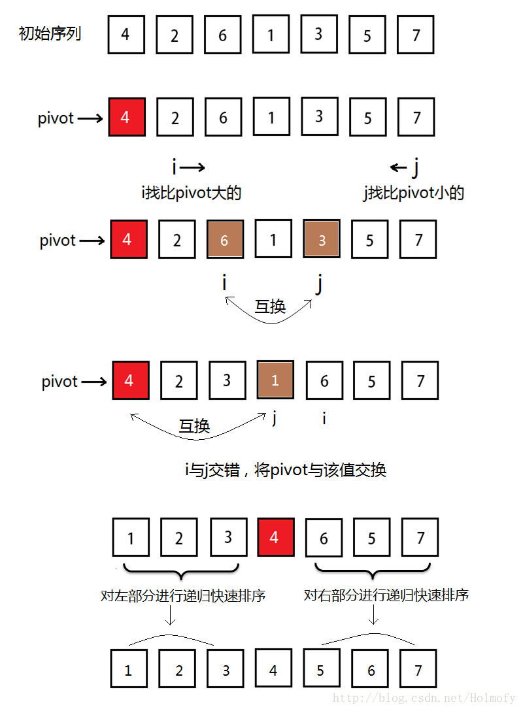
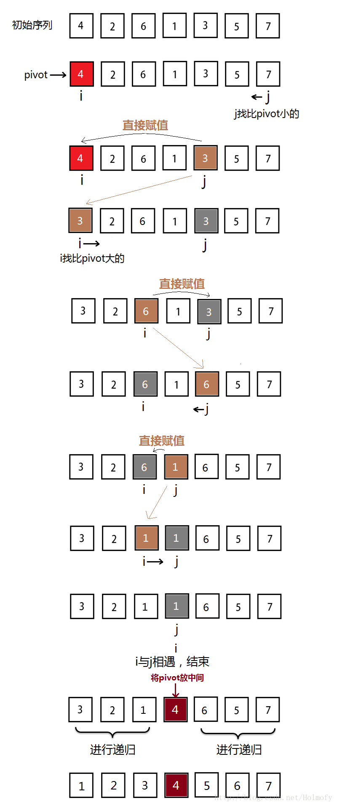
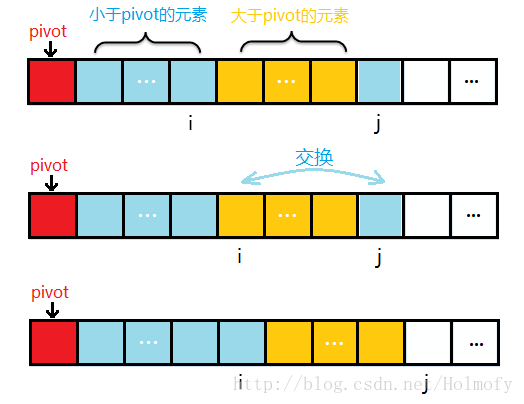
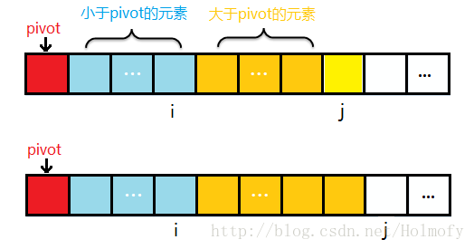
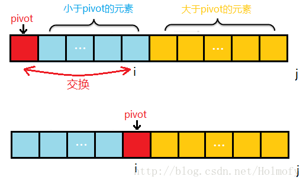
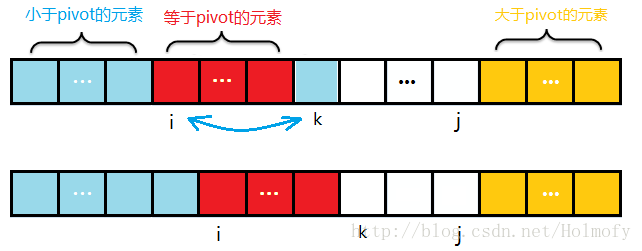
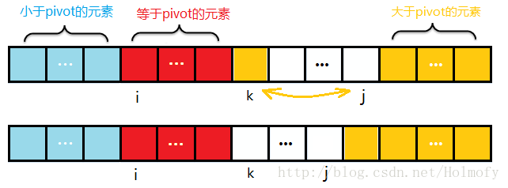
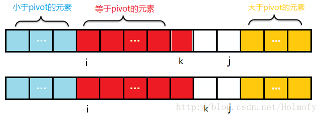
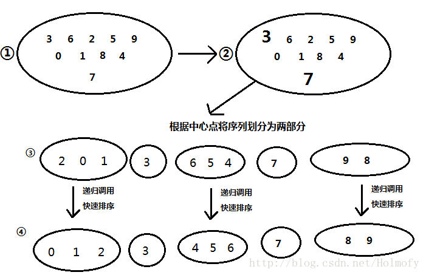

# 单轴快排与双轴快排

## **单轴快排**

单轴快排需要在待排序的数组中选择一个元素作为转轴（pivot）。将小于或等于pivot的元素，和大于pivot的元素划分开来。

具体步骤：

1. 先从数组中取出一个数作为转轴（pivot）。
2. 分区过程，将小于或等于pivot的数全放到它的左边，大于pivot的数全放到它的右边。
3. 再对左右区间递归执行第二步，直到各区间只有一个数。

一次排序过程只能排序正确一个元素的位置，即 **pivot** 的位置。

## **元素划分的方式**

### **1. 两端扫描交换方式**



```java
/**
* 双端扫描交换 Double-End Scan and Swap
 * @param items
 */
public static void deScanSwapSort(int[] items){
        partition(items,0,items.length-1);
    }

    public static void partition(int[] items,int leftBound, int rightBound){
        if(leftBound < rightBound){
            int pivot = items[rightBound]; // 本例是选取最末尾的元素作为 pivot
            int left=leftBound,right=rightBound-1;
            while(left<=right){
                while(left<=right && items[left] <= pivot) left++;
                while(left<=right && items[right] > pivot) right--;
                if(left<right){
                    swap(items,left,right);
                }
            }
            swap(items,left,rightBound); // 此时 left 的位置就是 pivot 元素的正确位置
            partition(items,leftBound,left-1);
            partition(items,left+1,rightBound);
        }
    }

    public static void swap(int[] items,int left,int right){
        int tmp = items[left];
        items[left] = items[right];
        items[right] = tmp;
    }
```

### **2. 赋值填充方式——一端挖槽一端填充**



```java
    /**
     * 直接赋值填充方式
     * @param items
     */
    public static void fillSort(int[] items){
        fillSortPartition(items,0,items.length-1);
    }

    public static void fillSortPartition(int[] items,int leftBound, int rightBound){
        if(leftBound < rightBound){
            int pivot = items[leftBound];
            int left = leftBound, right = rightBound;
            while(left<right){
                while(left<right && items[right]>pivot) right--;
                items[left]=items[right];
                while (left<right && items[left]<=pivot) left++;
                items[right]=items[left];
            }
            // 相遇后 left == right，此处是个槽
            items[left]=pivot;
            fillSortPartition(items, leftBound, left-1);
            fillSortPartition(items,left+1,rightBound);
        }
    }
```

Golang 版本

```go
func QuickSort(nums []int) {
	partition(nums, 0, len(nums)-1)
}

func partition(nums []int, leftBound, rightBound int) {
	if leftBound < rightBound {
		left, right := leftBound, rightBound
		pivot := nums[left]
		for left < right {
			for left < right && nums[right] > pivot {
				right--
			}
			nums[left] = nums[right]
			for left < right && nums[left] <= pivot {
				left++
			}
			nums[right] = nums[left]
		}
		nums[left] = pivot
		partition(nums, leftBound, left-1)
		partition(nums, left+1, rightBound)
	}
}
```


### **3. 单向扫描划分区域——将区域划分为小于pivot 区域，大于等于 pivot 区域，待处理区域**

1. 初始时，i=start， j=start+1；j负责扫描整个序列。

   

2. 扫描过程中始终保持着序列中: **1.范围`[start+1, i]` 是小于 `pivot`；2.范围`[i+1, j]`是大于 `pivot`的**。

   

3. 为了保持 **2 规则**，j 扫描时遇到小于 pivot 的元素时，i++ ，并将 i 元素与 j 元素进行交换，然后扫描下一个元素；

   

   遇到大于 pivot 的元素，直接扫描下一个元素。

   

4. 整个序列扫描完成后，将第一个元素 pivot 与小于 pivot 的元素的最后一个进行交换。

   

```java
/**
 * 单向扫描划分区域方式
 *
 * @param items
 *            待排序数组
 */
public void forwardScanSort(int[] items) {
    forwardScanSort(items, 0, items.length - 1);
}

public void forwardScanSort(int[] items, int start, int end) {
    if (start < end) {
        int pivot = items[start];
        int i = start, j = start + 1;
        while (j <= end) {
            if (items[j] < pivot) {
                i++;
                swap(items, i, j);
            }
            j++;
        }
        swap(items, start, i);
        forwardScanSort(items, start, i - 1);
        forwardScanSort(items, i + 1, end);
    }
}
```

### **4. 单轴快排的一种优化方式——三分单向扫描（荷兰国旗问题）**

1. 初始化时，i=start, j=end， k=start+1。k 负责扫描。

   

2. 扫描过程中始终保持着三个区域：[start,i]是小于 pivot 的区域，[i,k]是等于 pivot 的区域，[j,end] 是大于pivot的区域。

   

3. 扫描过程中，遇到小于 pivot 的元素，i 与 k 元素进行交换，i++,然后k 扫描下一个元素；

   

   遇到大于 pivot 的元素，k 与 j 交换 ， j --，k 不需要加一，继续扫描k 处元素。

   

   扫描过程遇到等于pivot 的元素，直接扫描下一个元素。

   

4. pivot 已经包含在等于 pivot 的分段中，无需交换。最后 k>j 的时候停止扫描。

```java
/**
 * 三分区域单向扫描
 */
public void div3ScanSort(int[] items) {
    div3ScanSort(items, 0, items.length - 1);
}

public void div3ScanSort(int[] items, int start, int end) {
    if (start < end) {
        int pivot = items[start];
        int i = start, j = end, k = start + 1;
        while (k <= j) {
            if (items[k] < pivot) {
                swap(items, i, k);
                i++;
                k++;
            } else if (items[k] > pivot) {
                swap(items, j, k);
                j--;
            } else {
                k++;
            }
        }
        div3ScanSort(items, start, i - 1);
        div3ScanSort(items, j + 1, end);
    }
}
```

### **5. 三分区域的另一种优化**

在上面的实现中，扫描到大于pivot 的元素，将最后一个未扫描的元素（j所在位置）与当前元素（k所在位置）进行交换。那如果这个未扫描的元素正好是比 pivot 大的元素呢，这无疑增加了交换的次数。

```java
/**
 * 双端扫描三分排序
 */
public void div3DeScanSort(int[] items) {
    div3DeScanSort(items, 0, items.length - 1);
}

public void div3DeScanSort(int[] items, int start, int end) {
    if (start < end) {
        int pivot = items[start];
        int i = start, j = end, k = start + 1;

        OUT_LOOP: while (k <= j) {
            if (items[k] < pivot) {
                swap(items, i, k);
                i++;
                k++;
            } else if (items[k] == pivot) {
                k++;
            } else {
                // j向左扫描，直到一个不大于pivot的元素
                while (items[j] > pivot) {
                    j--;
                    if (k > j) {
                        // 后面的待排元素全大于pivot，直接结束排序
                        break OUT_LOOP;
                    }
                }
                if (items[j] < pivot) {
                    swap(items, j, k);
                    swap(items, i, k);
                    i++;
                } else {
                    swap(items, j, k);
                }
                k++;
                j--;
            }
        }
        div3DeScanSort(items, start, i - 1);
        div3DeScanSort(items, j + 1, end);
    }
}
```

## **双轴快排**

双轴快排需要两个转轴 pivot1, pivot2, 且 pivot1<=pivot2，可将序列分成三段：`x<pivot1`，`pivot1<=x<=pivot2`,`pivot2<=x`，然后分别对三段进行递归。



既然要两个中心点，一般将第一个元素与最后一个元素作为两个中心占。实现过程如下：

1. 初始化时， i=start， j=end，k=start+1，k负责扫描。序列第一个值大于序列最后一个值，需要进行交换。然后 `pivot1=items[start]`， `pivot2=items[end]`。

2. 扫描过程中保持：`[1,i]`是小于`pivot1`的区域，`[i,k]`是大于等于`pivot1`且小于等于`pivot2`的区域，`[j,end]`是大于`pivot2`的区域。

   

3. 扫描过程与前面三分区域双向扫描类似。

4. 最后扫描完成时，将 pivot1 与 pivot2 移到中间。

```java
/**
 * 双轴快排
 *
 * @param items
 */
public void dualPivotQuickSort(int[] items) {
    dualPivotQuickSort(items, 0, items.length - 1);
}

public void dualPivotQuickSort(int[] items, int start, int end) {
    if (start < end) {
        if (items[start] > items[end]) {
            swap(items, start, end);
        }
        int pivot1 = items[start], pivot2 = items[end];
        int i = start, j = end, k = start + 1;
        OUT_LOOP: while (k < j) {
            if (items[k] < pivot1) {
                swap(items, ++i, k++);
            } else if (items[k] <= pivot2) {
                k++;
            } else {
                while (items[--j] > pivot2) {
                    if (j <= k) {
                        // 扫描终止
                        break OUT_LOOP;
                    }
                }

                if (items[j] < pivot1) {
                    swap(items, j, k);
                    swap(items, ++i, k);
                } else {
                    swap(items, j, k);
                }
                k++;
            }
        }
        swap(items, start, i);
        swap(items, end, j);

        dualPivotQuickSort(items, start, i - 1);
        dualPivotQuickSort(items, i + 1, j - 1);
        dualPivotQuickSort(items, j + 1, end);
    }
}
```

## 找第 K 大的元素

```go
// 找第 K 大的元素
func findKthLargest(nums []int, k int) int {
    return partition(nums, k)
}

func partition(nums []int, k int) int {
    // 挖槽法
		left := 0
    pivot := nums[left]
    right := len(nums)-1
    for left < right{
        for left < right && nums[right]<=pivot{
            right--
        }
        nums[left] = nums[right]
        for left < right && nums[left]>= pivot{
            left++
        }
        nums[right] = nums[left]
    }
    nums[left] = pivot
    if left == k-1{
        return nums[left]
    }else if left > k-1{
        return partition(nums[:left], k)
    }else{
        return partition(nums[left+1:], k-1-left)
    }
}
```


## **参考**

[单轴快排（SinglePivotQuickSort）和双轴快排（DualPivotQuickSort）及其JAVA实现](https://blog.csdn.net/holmofy/article/details/71168530)