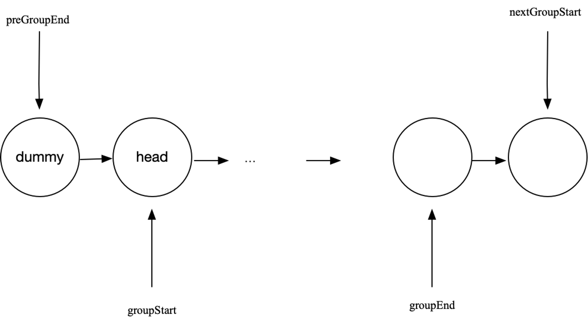
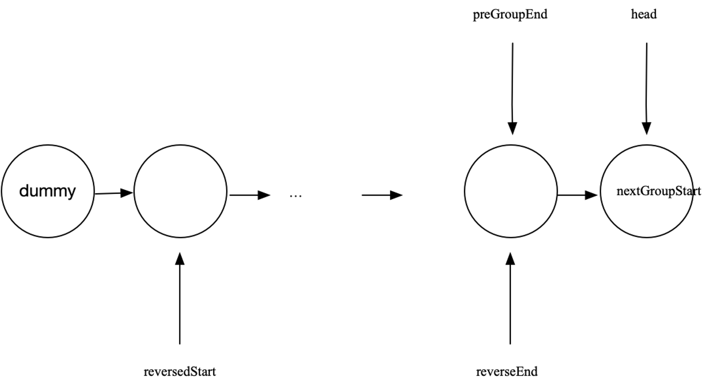

# 链表相关

## 链表反转

```go
type ListNode struct {
    Val  int
    Next *ListNode
}

// 反转尾节点为 nil 情况
func reverseList(head *ListNode) *ListNode {
    var prev *ListNode
    curr := head
    for curr != nil {
        curr.Next, prev, curr = prev, curr, curr.Next // 一次赋多值时，会将右边计算好同时赋给左边
    }
    return prev
}

// 反转尾节点不为 nil 情况
func myReverse(head, tail *ListNode) (*ListNode, *ListNode) {
	prev := tail.Next
	cur := head
	for prev != tail {
		cur.Next, cur, prev = prev, cur.Next, cur
	}
	return tail, head
}
```

## 快慢指针

```go
type ListNode struct {
    Val  int
    Next *ListNode
}

func findMiddle(head *ListNode) *ListNode {
    if head == nil {
        return nil
    }
    slow, fast := head, head
    for fast != nil && fast.Next != nil {
        slow, fast = slow.Next, fast.Next.Next
    }
    return slow
}
```

## K 个一组反转链表





```go
// reverseKGroup reverses every k nodes in the linked list.
func reverseKGroup(head *ListNode, k int) *ListNode {
    // Create a dummy node as a starting point.
    dummy := &ListNode{Next: head}
    prevGroupEnd := dummy  // The end of the previous reversed group.

    for head != nil {
        groupStart := head
        groupEnd := prevGroupEnd  // start by assuming end is at the beginning of the group

        // Move groupEnd to the actual end of the group.
        for i := 0; i < k; i++ {
            groupEnd = groupEnd.Next
            if groupEnd == nil {
                return dummy.Next
            }
        }

        // Record the start of the next group.
        nextGroupStart := groupEnd.Next

        // Reverse the current group.
        reversedStart, reversedEnd := reverseList(groupStart, groupEnd)

        // Attach the reversed group to the result list.
        prevGroupEnd.Next = reversedStart
        reversedEnd.Next = nextGroupStart

        // Move to the next group.
        prevGroupEnd = reversedEnd
        head = nextGroupStart
    }

    return dummy.Next
}

func reverseList(head, tail *ListNode) (*ListNode, *ListNode) {
	prev := tail.Next
	cur := head
	for prev != tail {
		cur.Next, cur, prev = prev, cur.Next, cur
	}
	return tail, head
}
```

