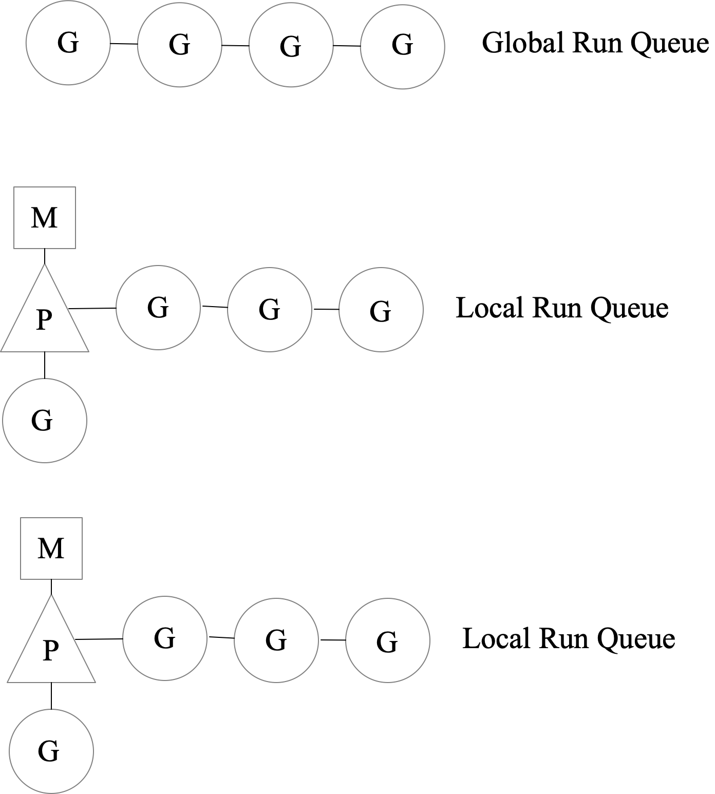

# Go 语言相关

## 协程

### 基本概念

1）进程：应用程序的启动实例，每个进程有独立的内存空间，进程间通过 IPC 通信；

2）线程：从属于于进程，CPU 的调度的基本单位；

3）协程：不受操作系统调度，协程调度器由用户应用程序提供；

### 线程模型（用户线程：内核线程）

1）N:1

2）1:1

3）M:N

### Go 调度器模型

M machine 内核线程；P processor 调度器；G goroutine 协程；



M 要持有 P 才可以执行代码。

1）P 会周期性地看全局 GRQ，防止 GRQ 中的 G 被“饿死”；

2）M 产生系统调用阻塞时会释放 P；

3）工作量窃取，当某个处理器 P 没有需要调度的 G 时，将从其他 P 中偷取 G；

### GMP 模型中为什么要有 P 这一层？

在 Go 的 GMP 模型中，P (Processor) 扮演着非常关键的角色。P 作为一个桥梁，连接了 M (Machine，代表操作系统线程) 和 G (Goroutine)。下面是为什么要引入 P 的几个主要原因：

1. **并发控制**：`GOMAXPROCS` 通常设置为机器的 CPU 核心数，代表了可以同时运行的 P 的数量。通过控制活跃的 P 数量，Go 可以限制真正并行执行的 Goroutine 数量，从而有效地控制并发度并避免过度的上下文切换。

2. **本地化调度**：**每个 P 都有一个本地的 Goroutine 队列**（P维护一个协和队列）。当一个 Goroutine 结束或者被阻塞时，M 会首先从与其关联的 P 的本地队列中选择下一个要运行的 Goroutine，而不是从全局队列或其他 P 的队列中选择。这种设计可以减少锁的竞争和缓存的失效，从而提高调度的效率。

3. **平衡负载**：当一个 P 的本地 Goroutine 队列为空时，它会尝试从其他 P 的队列“窃取” Goroutine 来运行，或者从全局队列中获取。这种工作窃取的策略有助于保证所有的 CPU 核心都被充分利用，从而提高了程序的整体性能。

4. **减少全局锁的竞争**：由于每个 P 都有自己的本地 Goroutine 队列，所以在大多数情况下，Goroutine 的调度不需要访问全局队列，从而避免了全局锁的竞争。

5. **系统调用与网络轮询**：当一个 Goroutine 被阻塞，例如因为一个系统调用，与它关联的 M 会被分离出来，而 P 会被分配给另一个 M 来继续运行其他 Goroutine。这样，系统调用不会导致整个程序被阻塞。

简而言之，P 在 Go 的调度模型中扮演了一个中介的角色，使得 M 和 G 可以更加高效地互相配合，同时也带来了调度的灵活性和效率。**引入 P 是为了解决在高并发场景下的调度效率问题，确保 Go 程序可以充分利用多核 CPU 的性能。**

### M的最大数量是内核线程数么？

不完全是。M 在 Go 中代表了操作系统线程，但M的最大数量并不仅仅是受到 CPU 内核数（或线程数）的限制。实际上，Go 语言没有为 M 设置一个明确的上限。取而代之的是，**M 的数量是根据实际需要动态调整**的。

以下是一些相关的点来进一步解释这个问题：

1. **P 和 GOMAXPROCS**：P 的数量（代表可以并行执行的 Goroutines 的数量）默认是受 `GOMAXPROCS` 值的限制的，该值默认为机器的 CPU 核心数。但这并不直接决定 M 的上限。

2. **阻塞的 Goroutines**：当 Goroutine 进行阻塞操作（如系统调用）时，它当前所在的 M 可能会被分离，让 P 能够绑定到另一个 M 并继续执行其他 Goroutines。这种情况下，特别是在有大量系统调用或其他阻塞操作的情况下，M 的数量可能会远超过 CPU 的核心数。

3. **线程缓存**：Go 调度器会缓存一些最近使用过的 M (线程)，以避免频繁地创建和销毁线程。但即使这样，缓存的线程数也不一定与 CPU 的核心数相匹配。

4. **外部库或 Cgo**：使用 cgo 或直接调用某些外部库可能会在背后创建原生线程，这也可能会增加 M 的数量。

5. **手动创建的线程**：虽然这不是常见的做法，但 Go 程序可以创建额外的系统线程，这也会增加 M 的数量。

总之，M 的最大数量并不仅仅是受到 CPU 内核数的限制。**在实际运行的程序中，根据需要，M 的数量可能会增长，特别是在遇到多个阻塞操作或外部库调用时。**

### 如果没有 P 这一层的话，会变成什么样子？

如果 Go 语言的调度模型中没有 P (Processor) 这一层，那么事情将变得更加直接但也可能更加复杂。假设我们只有 M (Machine，代表操作系统线程) 和 G (Goroutine) 这两个实体，那么可能会出现以下的情况和挑战：

1. **直接调度**：每一个 M 直接从一个全局的 Goroutine 队列中选择 Goroutine 来执行。这样会使得锁的竞争变得更加频繁，因为所有的 M 都会尝试从同一个全局队列中取得任务。

2. **锁竞争和缓存一致性**：由于没有了本地的 Goroutine 队列，M 之间的锁竞争和缓存不一致可能会更加严重，这可能会导致调度的效率降低。

3. **固定并发度的问题**：`GOMAXPROCS` 的设置决定了可以并发执行的 Goroutine 的数量，但如果没有 P，那么我们可能需要其他的方式来限制真正并行运行的 M 的数量。

4. **工作窃取**：工作窃取策略可能会变得更加复杂。在现有的 GMP 模型中，当一个 P 的本地队列为空时，它会尝试从其他 P 的队列“窃取”任务。如果没有 P，M 可能需要直接从其他 M 的队列中窃取任务，这又会增加锁的竞争。

5. **系统调用的处理**：当前的设计允许一个 Goroutine 在系统调用中阻塞时释放其关联的 P，使得其他 M 可以与该 P 绑定并继续执行。如果没有 P，我们可能需要其他的机制来处理阻塞的 M，以保证 CPU 核心的利用率。

6. **复杂性的增加**：虽然省略 P 看似简化了模型，但实际上可能会引入新的复杂性。例如，如何均衡负载、如何处理阻塞的 Goroutine、如何减少全局锁的竞争等问题都可能需要新的策略和机制来解决。

总之，P 在 Go 的 GMP 调度模型中扮演了非常重要的角色，它为 M 和 G 之间提供了一个中介，有助于提高调度的效率、减少锁的竞争，并提供了一种灵活的方式来控制并发度。如果没有 P，我们可能需要重新设计整个调度模型并引入新的策略和机制来处理上述的挑战。

## Go 内存分配

Go 的内存分配策略是为了高效地支持并发和垃圾收集而设计的。

1. 内存堆栈分层：
   1. 堆：长生命周期的对象，由垃圾收集器管理。
   2. 栈：短生命周期的对象，例如函数调用的局部变量，由编译器自动分配和回收。
2. 大小 分类：
   1. Go 将对象根据大小分成小对象和大对象。
   2. 小对象使用 size classes 来分组，这有助于减少内存碎片。
3. 分配器设计：
   1. Go 使用了一个称为`mcache`的本地缓存策略，允许每个 M（操作系统线程）进行快速的内存分配，而不需要全局锁。
   2. 当`mcache`为空或需要更多内存时，它会从`mcentral`（中心列表）获取，这些列表按 size class 组织。
   3. 对于大对象或`mcentral`无法满足的请求，分配器会直接从`mheap`（全局堆）获取。
4. 内存释放：
   1. 当`mcache`满了，未使用的内存会被返还给 `mcentral`。
   2. `mcentral`会定期地将未使用的内存页返还给`mheap`。
   3. `mheap`会在适当的时机将内存返还给操作系统。
5. 逃逸分析：
   1. 编译时，Go 会进行逃逸分析来确定对象应该分配在堆还是栈上。
   2. 如果编译器认为对象的生命周期超出了其定义的作用域或可能在多个 Goroutine 之前共享，那么它可能会被分配到堆上。

### Go 内存分配对大小对象进行分类

在 Go 的内存管理和分配系统中：

- **mcache** 的全称是 "machine cache"。它是为每个 M（操作系统线程）提供的线程本地存储(TLS)，用于快速分配小对象，以避免在并发环境下的全局锁竞争。

- **mheap** 的全称是 "machine heap"。它代表了 Go 运行时的全局堆，用于存储所有 Goroutines 共享的数据。大对象的分配以及其他一些内存管理任务通常直接在 mheap 上执行。

Go 的内存分配器对对象进行了分类，以便更有效地管理和分配内存。

小对象：

* 小对象是指那些大小小于或等于 32KB 的对象。
* 这些对象在分配时使用固定大小的块，称为“span”。每个 span 包含许多同一大小的对象。
* 小对象进一步分为不同的“size classes”。每一个 size class 表示一组特定大小的对象。例如，8 字节、16 字节、32 字节等。
* 分配小对象非常快，因为它们通过直接从线程本地的缓存（`mcache`）中分配，而无需全局锁。
* 小对象的分配和回收策略旨在减少内存碎片。

大对象：

* 大对象是指那些大小超过 32KB 的对象。
* 这些对象直接从全局（`mheap`分配）。
* 大对象不使用 size classes，因为它们的大小不是固定的。
* 由于大对象通常较少且分布不均，所以它们有更高的内存碎片风险。
* 大对象在垃圾收集时可能需要更多的处理时间，因为它们占用的内存空间较大。

这种分类策略的好处在于，小对象的频繁分配和回收不会对全局堆造成过多压力，而大对象由于不是那么频繁地创建和销毁，可以直接从全局堆中分配和回收，而不会引起过多的性能开销。

## Go 垃圾回收

### 垃圾回收算法

1）引用计数，Python

优：对象可很快被回收，不会 STW；缺：循环引用难处理

2）标记-清除，Go，三色标记法

优：不需要处理循环引用；缺：STW

3）分代收集，Java

优：回收性能好；缺：算法复杂

### 垃圾回收原理

垃圾回收开始时以 root 对象（栈空间）扫描，把 root 对象引用的内存标记为“被引用”，递归地进行标记，只保留标记的内存，未被标记的内存全部标记为未分配，即完成回收。

1）三色标记法（可达性标记）

初始状态下所有对象都是白色，接着将 root 对象引用的对象置成灰对象，再递归分析，将灰对象所引用的对象置灰，其本身置黑。最终灰色队列为空，黑对象会被保留下来，白对象会被回收。

2）垃圾回收优化

1. 写屏障（write Barrier）

STW 的目的是防止 GC 扫描时内存变化，因此停止 go routine。

写屏障的目的是让 go routine 与 GC 同时运行的手段，写屏障开启，GC 过程中新分配的内存会被立即 标记，不会被本轮 GC 回收。

2. 辅助 GC

在 GC 执行过程中，如果 go routine 需要分配内存，那么 该 go routine 会参与一部分 GC 的 工作。

3）GC 触发

1. 阈值触发：阈值 = 上次 GC 内存分配量 * 内存增长率
2. 定期触发：最长 2 min
3. Runtime.GC()


## Go 并发控制

Go 提供了三种解决方案：1. Channel, 2.WaitGroup, 3. Context

## 内存逃逸

在Go语言中，内存逃逸（Memory Escape）是一个编译器优化相关的概念，主要涉及变量存储的位置：栈（Stack）还是堆（Heap）。

#### 基础概念：

1. **栈内存**: 栈内存用于存储函数调用和局部变量。它是临时的，当函数返回时，栈内存会被自动清理。
2. **堆内存**: 堆用于存储需要在函数调用之间持久存在的数据。

#### 何时会发生内存逃逸

* **返回局部变量的指针**: 如果一个函数返回了局部变量的地址，那么这个局部变量就不能存储在栈上，因为它的生命周期超过了函数本身。

```go
func foo() *int {
    x := 1
    return &x // x escapes to heap
}
```

* **将局部变量传给全局变量**: 如果局部变量的地址或引用被传给了全局变量，它也会逃逸到堆。

```go
var global *int

func bar() {
    x := 2
    global = &x // x escapes to heap
}
```

* **在闭包中引用局部变量**: 如果一个局部变量在闭包中被引用，它也将逃逸到堆，因为闭包可能在函数返回后仍然存在。

```go
func closure() func() int {
    x := 3
    return func() int { // x escapes to heap
        return x
    }
}
```

#### 如何检测内存逃逸

```go
go build -gcflags="-m" your_file.go
```

#### 为什么需要关心内存逃逸

- **性能**: 存储在堆上的变量需要垃圾收集，这会影响性能。
- **优化**: 了解内存逃逸有助于你编写更高效的代码。

## golang 会遇到 full GC 么

Golang的垃圾回收（GC）机制与Java等其他语言中的分代收集模型不同。在Java中，"Full GC"是指清理整个堆内存，包括年轻代和老年代。而在Go中，没有分代的概念，因此所有的GC操作本质上都是全堆回收。

但是，说Golang有"Full GC"可能会引起误解。以下是一些关于Golang垃圾回收的特点：

1. **非分代**：Go不使用分代收集，所以每次GC都会检查整个堆。
2. **并发执行**：自Go 1.5版本以来，GC的设计目标是并发执行，以最小化STW（stop-the-world）暂停。尽管在某些GC阶段仍然需要短暂的暂停，但这些暂停通常都很短。
3. **三色标记清除**：Go使用了并发的三色标记清除算法。在标记阶段，它会识别所有活跃的对象，然后在清除阶段回收未标记的对象。
4. **调节频率**：Go的GC运行频率可以通过环境变量`GOGC`来调节。`GOGC`表示当前堆大小与上次GC后的堆大小之间的百分比增长。当增长超过这个百分比时，会触发新的GC。

所以，虽然Go的每次GC都是全堆的，但与Java中的"Full GC"相比，它的影响和行为是不同的。Go的GC目标是保持延迟低，尽量不影响应用程序的执行。