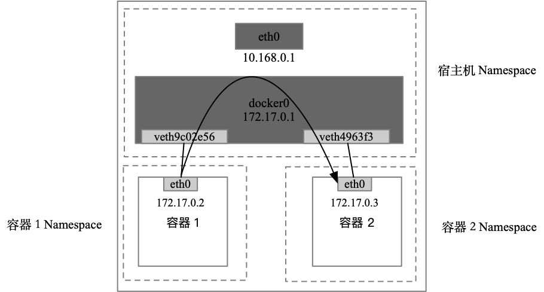
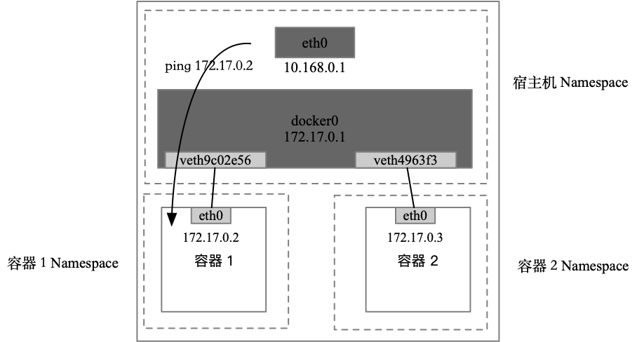
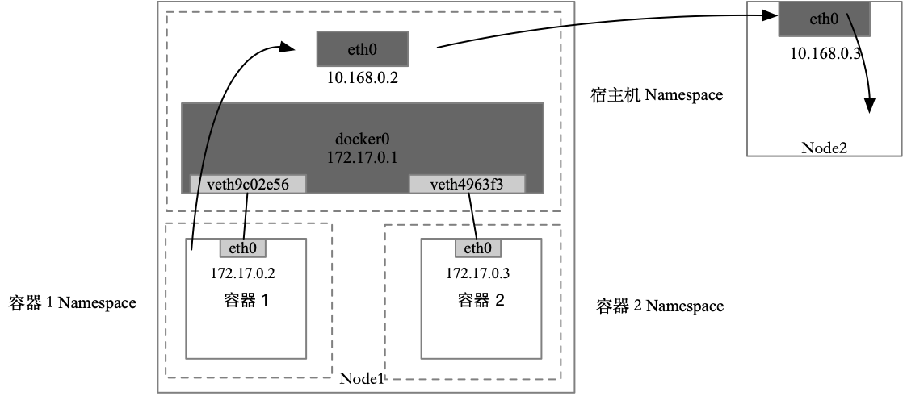
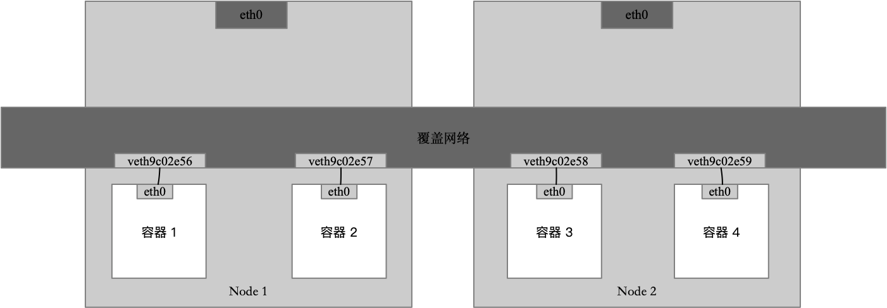
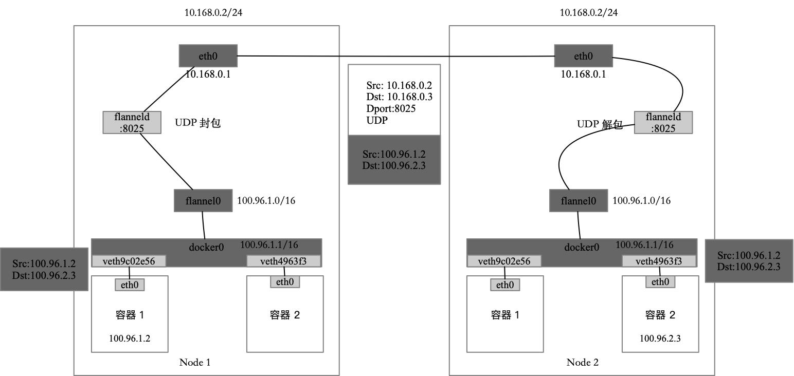
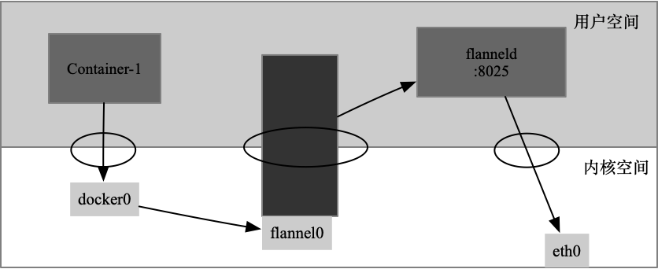

# K8s 相关

## K8s

### 详细说明K8s 各组件基本原理

Kubernetes（K8s）是一个开源的容器编排系统，用于自动化应用容器化的部署、扩展和管理。它有许多组件，且每个组件都执行特定的功能。以下是Kubernetes中的主要组件及其基本原理：

1. **Master节点组件**：Master节点是集群的控制节点，负责整个集群的管理和控制。

   - **kube-apiserver**：作为集群的控制面和入口点，它负责来自用户的请求，并将这些请求转发给相应的处理组件。
   
   - **etcd**：可靠的分布式数据库，用于保存集群配置数据，这是 k8s 中所有组件共享的唯一真实过程。
   
   - **kube-scheduler**：负责整个 Kubernetes 集群的调度，即根据调度算法，为新建立的 pod 选择一个 Node 进行运行。
   
   - **kube-controller-manager**：管理和运行控制器，如ReplicaSet、Deployment、Service等。

2. **工作节点组件**：工作节点（又称为工作负载节点）运行实际的应用程序。

   - **kubelet**：与 Master 节点上的 kube-apiserver 协作，管理 pods 和 nodes 上的容器，保证容器运行在期望的状态。

   - **kube-proxy**：在节点上作为服务负载平衡和网络代理的组件。
   
   - **Container Runtime**：负责运行和管理容器。Docker 是最常见的容器运行时，不过 Kubernetes 也支持其他容器运行环境，如containerd，CRI-O等。

3. **插件**：为 Kubernetes 提供额外的功能。

   - **CNI，Container Network Interface**：CNI 插件负责设置和撤销 Pod 网络。

   - **CSI，Container Storage Interface**： CSI 插件负责提供存储驱动，以便提供持久化存储功能。

   - **Ingress Controller**：负责管理外部访问集群中的服务的访问规则。

   - **DNS**：提供DNS服务，以便通过名称来访问服务，而不是通过 IP。

这就是 Kubernetes 的主要组件和基本原理。其组件化的设计使其具有高度的灵活性和可扩展性，可以适应各种复杂和变化的应用需求。

更多关于 Kubernetes 和它的组件的深入信息：

1. **API Server (kube-apiserver)**: 这是 K8s 集群的前端，它暴露了 Kubernetes API。这个 API Server 是集群中所有组件之间通信的中心。它会处理 REST 操作，控制在集群内所有的对象(如 pods、services 等)，并进行验证和配置数据的各种处理。

2. **Controller Manager (kube-controller-manager)**: 它运行了集群中涵盖了节点控制器、副本控制器、Endpoints 控制器、服务帐号 & 令牌控制器的核心控制循环。

3. **Scheduler (kube-scheduler)**: 它监视 API Server 中未调度的 Pods，并根据调度算法为 Pod 选择合适的工作节点。Scheduler 还会考虑各种因素(如资源需求、硬件 / 软件 / 策略约束、关联、数据位置等)进行调度。 

4. **etcd**: 如你问到的，etcd 是一个为 Kubernetes 提供配置存储的键值存储系统。它存储所有节点和集群水平面的关键数据，包括 ConfigMaps、Secrets、状态信息和集群元数据等。

5. **Kubelet**: 这个代理程序在每个节点上运行，它确保所有的容器都在运行，并且 Pods 的状态健康。此外，Kubelet 还会处理从控制平面转发到节点的一些指令。

6. **Kube-proxy**: 这个网络代理运行在每个节点上，维护节点的网络规则和四层负载均衡。当网络通信到达您的集群的 Pods 时，kube-proxy 将处理和转发这些通信。

7. **CoreDNS 或 KubeDNS**: 提供 DNS 服务的插件，以便其他服务可以使用 DNS 名称来自动发现其他 Pods 和服务。

这些是 Kubernetes 架构中的主要组件。使用这些组件，Kubernetes 可以提供极为强大的、可扩展的、自我修复的、跨多个主机的容器编排功能。

### K8s 是怎么调度的？

Kubernetes 采用控制器模型进行调度，这意味着它会定时检查当前集群状态，并将其与期望状态进行比较，以确定应执行的操作。

Kubernetes 调度主要分为以下若干步骤：

1. **Pod 创建**: 当你通过 Kubernetes API 创建 Pod，如果未指定 nodeName，意味着 Pod 没有被调度到任何节点，此时 Pod 的状态为 Pending。

2. **调度过程**

- **过滤**: Kubernetes 调度器会首先过滤出可以运行 Pod 的节点。调度器会基于预定义的策略（例如：节点有足够的 CPU 或内存资源、节点的磁盘类型或网络带宽满足需求，或者 Pod 对应的容器镜像已经在该节点上被预热），找出能够运行 Pod 的节点。

- **打分**: 过滤阶段之后，调度器会对可运行 Pod 的节点进行打分评估。评分是基于 Kubernetes 的优先级函数进行的。例如：Kubernetes 可以优先考虑没有负载、或尚未分配太多 Pod 的节点。相反，如果一个节点上的 Pod 数超过了一定的阈值，那么该节点的得分可能就会很低。

3. **Pod 放置**: 打分过程完成以后，调度器会选择得分最高的节点进行 Pod 放置。然后调度器将会更新 API Server 中 Pod 绑定的 Node 信息，之后 Kubelet 将会创建和运行 Pod。

4. **调度失败处理**: 如果所有的节点在过滤或打分阶段都未能成功，Pod 将处于未调度 ('unscheduled') 状态，并等待后续的调度周期。 记录调度错误的事件，可以通过 kubectl 命令查看这些事件，以帮助了解为什么 Pod 未调度。

此外，为了改善调度性能并满足更复杂的业务需求，Kubernetes 提供了 Pod 亲和性和反亲和性策略、普通优先级和抢占机制、Pod Topology Spread 限制等更高级的调度功能。

以上是 Kubernetes 的调度过程的大概流程，如果要详细了解这个过程，需要掌握很多 Kubernetes 的资源和配置概念，比如 Node、Pod、Taint、Toleration、Affinity、Priority 等等，同时也需要了解 Kubernetes 的整个生命周期管理机制。

### k8s 中 client-go 的 list-watch 机制中的 watch 是通过什么机制完成的

`client-go` 是 Kubernetes 官方提供的用于和 Kubernetes API 交互的 Go 客户端库，其中 List-Watch 机制用来监听 Kubernetes 集群中资源对象的变化。

List-Watch 机制中的 Watch 操作其实质是对 Kubernetes API Server 发起一个长连接的 HTTP 请求，这个请求会被 API Server 保持 "打开" ，而不会被立即关闭。当被 Watch 的资源对象发生变化时，API Server 会将变化的事件（例如：ADDED, DELETED, MODIFIED）推送到这个打开的连接上，客户端接收到这些事件后，根据请求中的回调函数进行处理。

API Server 监控资源的状态变化的能力主要得益于 etcd，etcd 是 Kubernetes 集群的键值存储数据库，用于保存集群的状态信息。etcd 本身支持 watch 机制，API Server 利用这个特性来监控各种资源的变化。当 etcd 中的键值发生变化时，这个变化会被 API Server 捕获并推送到对应的 Watch 连接上。

所以，Watch 机制的核心是由 HTTP 长连接和 etcd 的 watch 功能共同实现的。

### CNI，CSI，CRI

1. CNI（Container Network Interface）

CNI是一种通用的插件式网络解决方案，它定义了容器运行时（如Docker，Podman等）和网络插件之间的接口，以便为容器创建和配置网络。实际上，CNI插件负责创建并连接网络命名空间，向Pod分配IP地址，并在节点中设置路由规则。例如，Calico，Flannel，Weave等都是CNI插件。

2. CSI（Container Storage Interface）

CSI旨在定义一种标准化的机制，以便容器管理系统（如Kubernetes）如何暴露任何存储系统的抽象。简单的说，CSI插件允许容器管理系统像Kubernetes访问底层的存储系统，比如AWS EBS，Google Cloud Persistent Disk，Ceph等。CSI插件负责将存储卷挂载到Kubernetes Pod中，以便Pod可以使用这些存储。

3. CRI（Container Runtime Interface）

CRI旨在定义容器运行时应如何与Kubernetes一起工作，以便在Pod中运行容器。CRI定义了一套标准的gRPC接口，这些接口允许Kubernetes kubelet与容器运行时进行通信，以管理容器生命周期。例如，当Kubernetes需要在Pod中启动一个新的容器时，它将会使用CRI接口请求容器运行时（如Docker，containerd或cri-o）创建并启动该容器。

### K8s 网络原理



在默认情况下被限制在 Network Namespace 里的容器进程，实际上是通过 Veth Pair 设备+宿主机网桥的方式，实现了跟其他容器的数据交换的。



当你在一台宿主机上访问该宿主机上的容器 IP 地址时，这个请求的数据包也是先根据路由规则到达 docker0 网桥，然后转发到对应的 Veth Pair 设备，最后出现在容器里。



当一个容器试图连接其他宿主机时，比如 ping 10.168.0.3，它发出的请求数据包首先经过 docker0 网桥出现在宿主机上，然后根据宿主机的路由表里的直连规则（10.168.0.0/24 via eth0），对 10.168.0.3 的访问请求就会交给宿主机的 eth0 处理。所以接下来，这个数据包就会出现在宿主机的 eth0网卡转发到宿主机网络上，最终到达10.168.0.3对应的宿主机上。

当容器无法连通“外网”时，应该先试试 docker0 网桥，然后再查看跟 docker0 和 Veth Pair 设备相关的 iptables 规则是否有异常，往往能够找到问题的答案。



这个覆盖网络可以由每台宿主机上的一个“特殊网桥”共同组成。比如，当 Node 1 上的容器 1 要访问 Node 2 上的容器 3时，Node 1 上的“特殊网桥 ”在收到数据包之后，能够通过某种方式把数据包发送到正确的宿主机，比如 Node 2 上。而 Node 2 上的“特殊网桥”在收到数据后，也能够通过某种方式把数据包转发给正确的容器，比如容器 3。

#### Flannel 项目

真正提供容器网络功能的 Flannel 后端实现为：1. VXLAN；2.host-gw；3.UDP；

##### UDP 模式



Flannel UDP 模式提供的其实是一个三层的覆盖网络：它首先对发出端的 IP 包进行 UDP 封装，然后在接收端进行解封装拿到原始的 IP 包，接着把这个 IP 包转发给目标容器。这就好比，Flannel 在不同宿主机上的两个容器之间打通了一条“隧道”，使得这两个容器可以直接使用 IP 地址进行通信，而无须关心容器和宿主机的分布情况。



第一次，用户态的容器进程发出的 IP 包经过 docker0 网桥进入内核态；第二次，IP 包根据路由表进入 TUN（flannel0）设备，从而回到用户态的 flanneld 进程；第三次，flanneld 进行 UDP 封包之后重新进入内核态，将 UDP 包通过宿主机的 eth0 发出去。

此外，还可以看到，Flannel 进行 UDP 封装和解封的过程也都是在用户态完成的。在 Linux 操作系统中，上述上下文切换和用户态操作的代价较高，这也正是造成 Flannel UDP 模式性能不佳的主要原因。

所以，进行系统经编程时，有一个非常重要的优先原则：减少用户态到内核态的切换次数，并且把核心的处理逻辑都放在内核态进行。

##### VXLAN 模式


#### K8s 网络模型与 CNI 网络插件

Kubernetes通过一个叫作 CNI 的接口维护了一个单独的网桥来代替 docker0。这个网桥叫作 CNI 网桥，它在宿主机上的默认设备名称是 cni0。

Kubernetes 之所以要设置这样一个与 docker0网桥功能几乎相同的 CNI 网桥，有两个主要原因。

（1）Kubernetes 项目并没有使用 Docker的网络模型（CNM），所以它并不希望，也不具备配置 docker0网桥的能力。

（2）这还与 Kubernetes 如何配置 Pod，也就是 Infra 容器的 Network Namespace 密切相关。Kubernetes 创建 Pod 的第一步，就是创建并启动一个 Infra 容器，用来“hold”这个 Pod 的 Network Namespace。

所以，CNI 的设计思想就是，Kubernetes 在启动 Infra容器之后，就可以直接调用 CNI 网络插件，为这个 Infra 容器的 Network Namespace 配置符合预期的网络栈（网卡、回环设备、路由表和 iptables 规则）。

##### kube-proxy 与 cni 插件之间的交互关系

kube-proxy和CNI插件是Kubernetes中的网络组件，它们之间没有直接的交互，但它们共同工作以支持Kubernetes中的网络流量路由。

kube-proxy是Kubernetes中的每个节点上运行的网络代理，它实现了Kubernetes Service的概念。kube-proxy监听Kubernetes API服务器中服务和Endpoints对象的变化，然后根据这些变化实现网络路由。比如，一个服务可能有多个pod副本，这时kube-proxy就会代理这个服务的所有流量，然后将每个连接均匀分发到这些pod副本上。对于TCP和UDP流量，kube-proxy可以执行基于sessionAffinity的负载均衡。

CNI (Container Network Interface)插件在Kubernetes中用来处理Pod网络的设置和清理。当一个pod被创建或销毁时，Kubernetes调用CNI插件来设置或清理pod的网络。CNI插件可以负责分配IP地址给pod，创建和配置网络设备，以及设置路由规则等。

虽然kube-proxy和CNI插件没有直接交互，但它们共同工作以实现Kubernetes的网络功能。在实际工作中，kube-proxy负责服务发现和流量转发，而CNI插件则负责管理Pod网络，包括IP地址分配、网络设备的创建和配置等。总的来说，在网络流量中，kube-proxy和CNI插件各自承担了不同角色，他们共同确保了Kubernetes服务数据包准确高效的到达相应的目标。

##### kube-proxy和CNI插件分别负责哪些网络功能？

kube-proxy和CNI插件都是Kubernetes中支持网络通信的重要组件，但他们各自负责的网络功能是不同的：

kube-proxy：kube-proxy 是 Kubernetes 的网络代理，主要负责集群内服务的网络通信。kube-proxy 在每个 Kubernetes 节点上运行，监听集群中 Services 和 Endpoints 的变化，并相应地维护和更新网络规则，从而实现：
- 服务发现： kube-proxy 为集群中的每个 Service 创建虚拟 IP，并将来自该 IP 的请求转发到后端的 Pods。
- 负载均衡： 当多个 Pods 提供同一个服务时，kube-proxy 会在它们之间进行负载均衡，确保网络流量的均衡分配。

CNI（Container Network Interface) 插件： CNI插件主要负责Pod与Pod之间和Pod与Node之间的网络通信。当一个Pod被创建时，Kubernetes会调用相应的CNI插件，进行如下操作：
- 网络隔离：每个Pod具有自己独立的网络命名空间，与其他Pod彼此隔离。
- IP地址管理（IPAM）： 为Pod配置并分配IP地址。
- 网络路由设置： 在每个节点上配置网络路由规则，确保不同节点上的Pod之间能够进行网络通信。
- DNS配置： 对Pod中的/etc/resolv.conf进行配置，以便Pod可以通过DNS名解析集群内的Service。

总的来说，在Kubernetes中，kube-proxy负责服务发现和负载均衡，而CNI插件则负责Pod的网络设置和管理。

## Service

### service 与 endpoint 的关系

Service：Service 是 Kubernetes 提供的一种抽象定义，它定义了一组 Pod 的逻辑集合以及访问这些 Pod 的策略。由于 Pod 可能会频繁地被创建和销毁，因此使用 Service 可以保证服务的稳定可用。Service 可以通过标签选择器来确定它需要代表的 Pod。

Endpoints：Endpoints 是 Service 的一部分，通常由 kubernetes 自动维护。它包含了所有与 Service 对应的 Pod 的 IP 地址列表。当 Service 中定义的 Pod 发生变化的时候，比如有新的 Pod 被创建出来或者已经存在的 Pod 被销毁，对应的 Endpoints 列表也会自动更新。

所以我们可以把它们的关系理解为：Endpoints 实现了 Service 和 Pod 之间的映射，它记录了 Service 下所有 Pod 的 IP 地址。Service 通过引用 Endpoints 的方式，将用户的请求转发到对应的 Pod 地址上，实现了服务的负载均衡和服务发现。此外，用户可以手动创建和管理 Endpoints，以在 Kubernetes 外部提供服务。

使用以下命令可以看到该 service 后端的所有 endpoint。

```bash
kubectl describe svc xxx
```

### service 的负载均衡机制

在 Kubernetes 中，Service 提供了简单的负载均衡机制。当一个 Service 有多个后端 Pod 时，对 Service 的调用将被均匀地分配到这些 Pod 上，实现负载均衡。

这种负载均衡主要是通过 **kube-proxy** 实现的。kube-proxy 是 Kubernetes 节点上运行的网络代理，当有新的 Service 创建时，kube-proxy 会获取到这个 Service 对应的 Endpoints 列表（即后端 Pod 的 IP 地址），并将这些信息写入每个节点的 iptables 规则或者 ipvs 规则中。当一个请求发送到 Service 的 ClusterIP 或 NodePort 时，请求会被 kube-proxy 捕获并根据 iptables 或 ipvs 规则转发到一个 Endpoints 列表中的一项，实现负载均衡。

需要明确的是，kube-proxy 提供的负载均衡只是将请求简单地均匀分配到每个后端 Pod，它不考虑每个 Pod 的负载情况，也不支持更复杂的负载均衡策略，例如基于会话的负载均衡或者基于权重的负载均衡。如果需要更复杂的负载均衡策略，通常需要借助于其他的负载均衡器，例如云服务提供商提供的 LoadBalancer 类型的 Service 或者使用 Ingress 控制器等。

#### Kube-proxy 的代理模式

kube-proxy 是 Kubernetes 集群中的一个关键组件，负责在每个节点上进行网络转发，实现了 Service 对 Pod 的负载均衡。kube-proxy 目前支持三种代理模式：userspace，iptables，和 ipvs。

1. Userspace模式: 这是早期 kube-proxy 的默认模式。在该模式下，kube-proxy 会为每个 Service 创建一个监听端口，当请求来到这个端口时，kube-proxy 将选择一个后端 Pod 并将请求转发给它。此模式下，数据包需要在用户空间和内核空间之间多次切换，效率较低。

2. iptables模式: 这是 kube-proxy 的默认模式。在此模式下，kube-proxy 不再转发流量，而是直接在内核空间的 iptables 中设置规则，利用内核对流量进行处理，性能相较于 userspace 模式较高。但是 iptables 模式因为需要遍历所有规则链表，当服务数目较大时，性能会受到影响。

3. ipvs模式: 这是 kube-proxy 后来添加的一种模式，使用内核的 IPVS 功能对流量进行转发。IPVS 为每个服务维护了一个哈希表，因此无论后端服务数量有多少，查询效率都很高。在大规模服务数量下，性能比 iptables 模式有较大的提高。

#### 会话保持机制

sessionAffinity

## StatefulSet

### （1）网络标识

#### 为什么要有这一行 serviceName: "nginx"

```yaml
apiVersion: apps/v1
kind: StatefulSet
metadata:
  name: web
spec:
  serviceName: "nginx"
  replicas: 2
  selector:
    matchLabels:
      app: nginx
  template:
    metadata:
      labels:
        app: nginx
    spec:
      containers:
      - name: nginx
        image: nginx:1.9.1
        ports:
        - containerPort: 80
          name: web 
```

StatefulSet 与 Deployment 的唯一区别就是多了一行`serviceName: "nginx"`，为什么要有这一行呢？

在 Kubernetes 中，StatefulSet 控制器的 spec 字段中有一个称为 serviceName 的属性。这个属性的值理应对应到 Kubernetes 集群中的一个已存在的 Service。

在 StatefulSet 中，serviceName 属性的设定非常重要。主要有两个作用：

1. **该服务用来为该 StatefulSet 中的每个 Pod 提供网络标识。**只有指定 serviceName，Pod才能具有稳定的 hostname 和 network domain。每个 Pod 的 hostname 被设定为 $(statefulset name)-$(ordinal)。这里的 ordinal 是 Pod 在 StatefulSet 中的编号（从0开始）。而network domain 是 $(service name).$(namespace).svc.cluster.local，实例化后，Pod 的完全限定域名就被设定为 $(podname).(governing service domain) ，例如 web-0.nginx.default.svc.cluster.local。

2. 在有些情况下（例如，在执行领导者选举或执行对等识别等操作时），StatefulSet 中的每个 Pod 需要能够相互发现对方。通常，我们利用通过一个 headless service（就是指定的 serviceName 对应的服务）进行服务发现。

因此，serviceName 属性主要用于 StatefulSet 中网络标识的设定和 Pod 间的服务发现。

#### 如果  serviceName: "nginx" 对应的 nginx service 没有创建呢？

如果你在创建StatefulSet前没有创建对应的Service（在你的例子中，对应的是名为“nginx”的Service），那么**StatefulSet仍然会被创建，Pod也将被启动，但这些Pod的网络标识（也就是其主机名和域名）将无法被正确设置。**

在 Kubernetes 中，StatefulSet 依赖于 Kubernetes 的 DNS 服务来提供网络标识，而这是通过关联的 Service 来实现的。因此，你的Pod可以运行，但是它们在网络上的名称将无法正常使用。所以，在应用需要依赖Pod的网络标识来进行通信或者执行其它操作的场景下，这样的设置将会导致问题。

更为重要的是，如果你的应用基于Pods之间能互相发现（例如，在一些分布式应用中，Pods需要彼此发现以进行领导人选举或其他协作行为），那么未创建对应的 Headless Service 将会直接导致应用无法正常工作。因为，在这种情况下，Pods通常会试图通过 Kubernetes 的 DNS 服务去查找其它的族群成员，但只有在对应的 Service 创建好后它们才能被正确解析。

总的来说，如果没有创建 StatefulSet 对应的 Service，StatefulSet 仍将被创建并且其Pod也会启动运行。然而，由于网络标识无法正确设置，以及 Pod 无法进行服务发现等原因，这将可能导致你的应用无法正常工作。因此，除非对你的应用来说这些并不重要，否则在创建 StatefulSet 之前最好始终先创建好对应的 Service。

### （ 2）存储状态

当你把一个 StatefulSet 的 Pod（比如 web-0）删除之后，这个 Pod 对应的 PVC 和 PV 并不会被删除，而这个 Volume 里已经写入的数据也依然会保存在远程存储服务里。此时，StatefulSet 控制器发现，一个名叫 web-0 的 Pod 消失了。所以，控制器会重新创建一个新的、名字还是 web-0 的 Pod，来“纠正”这种不一致的情况。

需要注意的是，在这个新的 Pod 对象的定义里，它声明使用的是 PVC 的名字还是 www-web-0。这个 PVC 的定义仍然来自 PVC 模板（volumeClaim Templates），这是 StatefulSet 创建 Pod 的标准流程。所以，在这个新的 web-0 Pod 被创建出来之后，Kubernetes 为它查找名叫 www-web-0 的 PVC 时，就会直接找到旧 Pod 遗留下来的同名 PVC，进而找到跟这个 PVC 绑定的 PV。这样新的 Pod 就可以挂载到旧 Pod 对应的那个 Volume，并且获取保存在 Volume 里的数据了。通过这种方式，Kubernetes 的 StatefulSet 就实现了对应用存储状态的管理。

### StatefulSet 的工作原理

**首先，StatefulSet 的控制器直接管理的是 Pod。**这是因为 StatefulSet 里的不同 Pod 实例不再像ReplicaSet 中那样都是完全一样的，而是有了细微区别。比如，每个 Pod 的 hostname、名字等都不同，都携带了编号。而 StatefulSet 通过在 Pod 的名字里加上事先约定好的编号来区分这些实例。

**其次，Kubernetes 通过 Headless Service 为这些有编号的 Pod，在 DNS 服务器中生成带有相同编号的 DNS 记录。**只要 StatefulSet 能够保证这些 Pod 名字里的编号不变，那么 Service 里类似于 web-0.nginx.default.svc.cluster.local 这样的 DNS 记录就不会变，而这条记录解析出来的 Pod 的 IP 地址，会随着后端 Pod 的删除和重建而自动更新。这当然是 Service 机制本身的能力，不需要 StatefulSet 操心。

**最后，StatefulSet 还为每一个 Pod 分配并创建一个相同编号的 PVC。**这样，Kubernetes 就可以通过 Persistent Volume 机制为这个 PVC 绑定对应的 PV，从而保证了每个 Pod 都拥有一个独立的 Volume。

在这种情况下，即使 Pod 被删除，它对应的 PVC 和 PV 依然会保留下来。所以当这个 Pod 被重新创建出来之后，Kubernetes 会为它找到编号相同的 PVC，挂载这个 PVC 对应的 Volume，从而获取以前保存在 Volume 里的数据。

## etcd

### 详细说明一下 Raft 协议

Raft协议是一种用于管理复制日志的一致性算法，它相对于其它的分布式一致性算法比如Paxos来说，更容易理解和实现。以下是Raft协议的一些关键原理：

1. **领导选举（Leader Election）**：在任何时刻，Raft集群中都有一个Leader节点，它负责处理所有的客户请求。如果当前的Leader节点崩溃或者与其它节点失去联系，其它的节点将会通过选举选出一个新的Leader。**选举开始时，每个节点都会随机等待一段时间，然后向其它节点发送投票请求。接收到请求的节点如果没有投给其它节点，就会投给请求者。节点收到大多数的投票（超过半数）就成为新的Leader。**

2. **日志复制（Log Replication）**：Leader节点接收到客户端的改变状态的请求之后，将其作为一个日志条目添加到自己的日志中，然后将这个日志条目发送给所有的追随者节点（Follower）。当一个Follower节点确认成功写入该日志条目之后，Leader节点会更新该节点的复制日志信息。当大多数的Follower节点都确认成功写入后，这个日志条目就被提交，Leader节点会应用这个日志条目到其状态机，并返回结果给客户端。

3. **安全性（Safety）**：Raft协议满足一致性需求，即所有的副本在相同的日志位置的日志条目都是相同的。此外，当一个日志条目被应用到状态机后，所有后续的日志条目都对应更高的任期号和索引号。当Leader节点崩溃时，新的Leader节点必须拥有当前所有已提交的日志。

4. **日志领导者的完整性（Leader Completeness）**：**任何已经选为Leader的节点，其日志必须包含所有被提交的日志。**

5. **集群成员变更**：Raft协议提供了一种称为集群成员变更的机制，可以用于动态的添加或移除节点。这个过程通过一个双阶段的过程来完成，首先是添加一个新配置的日志条目但是不立即提交，然后是移除旧配置的条目并提交新配置。

以上是Raft协议的关键原理，这种协议在构建高可用的分布式系统中发挥了关键作用。

### etcd 是如何注册服务的？

etcd是一个分布式键值存储系统，它主要用于共享配置和服务发现。然而它并不直接进行服务注册。服务注册一般是由使用etcd作为后端存储的服务注册中心完成的，比如Google的Kubernetes就是如此。

下面是一个通用的使用etcd进行服务注册的过程：

1. 当服务启动时，服务会将自己的一些信息（比如服务地址、服务端口、服务健康状态等）打包成一个键值对，然后存储到etcd上。这个键一般会包含服务的名字和服务的唯一标识，值就是服务的具体信息。

2. 这个键值对在etcd中的存放会有一个TTL（time-to-live），也就是生存时间。服务需要定期去更新这个键值对来维持自己在etcd中的注册信息。如果服务停止更新，那么当TTL到期后，etcd会自动删除这个键值对，相当于服务被注销了。

3. 其他服务或者客户端，如果想要找到这个服务，可以从etcd中查询这个服务的信息。因为etcd支持观察者模式，所以服务状态有变更（比如服务上线、服务下线等）的时候其他服务或者客户端都可以及时被通知。

以上只是对etcd服务注册的一个基本流程描述，具体可能会有各种变种和优化。比如在Kubernetes中并不会直接使用etcd进行服务注册，而是会借助Kubernetes的service和endpoint对象来间接实现。但最终这些信息还是会被存储在etcd中作为服务的"事实库"。

### etcd 是如何进行服务发现的？

`etcd` 是一个分布式、可靠的键值存储系统，可以用于配置共享和服务发现。以下是一个 etcd 的服务发现的基本流程：

1. **服务注册**

   当一个服务启动时，它会将自己的地址和端口等信息作为一个键值对写入到 etcd 中，这个过程叫服务注册。键通常是由服务名和服务的唯一标识组成，值则包含服务的详细信息。例如，一个搜索服务可以使用 /services/search/{服务id} 作为键，值则是该服务的详细信息。

2. **服务续约**

   为了确保注册的服务是健康的，etcd 提供了租约（Lease）的概念。每一个注册到 etcd 中的服务会有一个对应的租约，服务需要定期去 etcd 续租，表明自己还活着。如果一个服务挂掉了，就不会再去续租，租约到期后，对应的服务信息就从 etcd 中被移除。

3. **服务发现**

   当其他服务或者客户端需要查找某个服务时，可以查询 etcd 中对应的键值对获取服务的信息，这被称为服务发现。比如一个前端服务需要调用搜索服务，它就可以去 etcd 中查找 /services/search/ 下的键值对，获取所有的搜索服务列表。

4. **服务监听**

   此外，etcd还支持 watch 机制，允许客户端监听某个前缀的键，并获得键的变更通知，比如新增、修改和删除操作。如果监听 /services/search/，那么搜索服务的上线和下线都会通知到前端服务，前端服务可以据此更新自己持有的搜索服务列表，从而实现服务发现的动态更新。

这就是基于 etcd 实现服务发现的基本原理和方法。

### etcd 怎么处理未同步的数据

etcd 是一个分布式键值对存储系统，设计用于存储可能由分布式系统（如调度器或者数据库）访问的数据。它主要关注安全性，一致性，并为处理大规模网络和故障提供了可靠性。etcd 内部使用 RAFT 协议来处理未同步的数据和处理故障。RAFT 是一个一致性算法，用于处理这种未同步情况。这里是 etcd 如何处理未同步数据的详细说明：

1. **选举领导者**：etcd 集群中的所有服务器都运行 RAFT 一致性算法，并可以成为领导者。这些服务器通过竞选和投票来决定出一个领导者。

2. **客户端请求处理**：所有的写操作都由领导者来处理。当领导者收到客户端的请求后，它首先记录下这次操作到日志中，但不立即执行。

3. **日志复制**：接下来，领导者会把这个日志条目发送到所有的追随者服务器，要求它们也把这个日志条目记录下来。这一过程被称为日志复制。

4. **确认和执行**：只有当大多数的追随者都确认已经记录了这个日志条目后，领导者才会真正执行这个操作，并把结果返回给客户端。同时，领导者也会通知所有的追随者执行这个操作。

5. **故障处理**：如果在日志复制的过程中，有追随者没能及时响应，领导者会不断重试，直到所有的追随者都记录了这个日志条目。如果领导者宕机，那么重新选举新的领导者。

以上就是 etcd 如何处理未同步数据的过程。通过这种方式，etcd 可以保证即使在网络分区、服务器故障等情况下，只要有大多数的服务器能够正常通信，etcd 集群就能继续提供服务，并保证数据的一致性。

## 多路复用

### epoll 的基本工作原理是什么？

Epoll是Linux内核中的一种I/O多路复用技术，它能有效处理大量并发的文件描述符，且在文件描述符数量增加时性能不会下降太多。

Epoll的基本工作原理可以概括为以下几步：

1. **创建Epoll对象**：使用epoll_create函数创建一个Epoll对象。调用成功后会返回一个文件描述符，这个文件描述符被用来唯一标识这个Epoll对象。

2. **向Epoll对象注册文件描述符**：通过epoll_ctl函数将需要监听的文件描述符添加到Epoll对象中，并同时指定关心的事件，比如EPOLLIN（表示对应的文件描述符可读）、EPOLLOUT（表示对应的文件描述符可写）等。

3. **等待事件发生**：使用epoll_wait函数阻塞等待注册在Epoll对象上的一个或多个文件描述符上的事件发生。这个函数会返回发生事件的文件描述符，以及这些文件描述符上发生的具体事件。

4. **处理事件**：根据epoll_wait返回的结果处理对应的事件。处理完后再次调用epoll_wait继续等待事件发生。

Epoll相比其他的I/O多路复用技术（如：select、poll）的优势在于，其内部使用了基于事件驱动的方式来处理文件描述符，而不是像select或poll那样需要轮询所有文件描述符。当关注的事件发生时，内核会采用回调的方式通知用户程序，而不需要用户程序主动查询。这大大提高了在处理大量文件描述符时的效率。

---

Epoll 是 Linux 系统提供的 I/O 多路复用机制，其优势在于当需要监视大量文件描述符时，它仍能够以较小的开销完成任务。它是通过Linux内核解决并发I/O问题的重要机制之一。

epoll的基本工作原理如下：

1. **使用`epoll_create`函数创建一个epoll对象**：这个函数会返回一个文件描述符，表示创建的 epoll 实例。

2. **使用`epoll_ctl`函数向这个epoll对象中添加/修改/删除要监听的文件描述符**：也就是说，你可以告诉 epoll 对象你感兴趣的事件，比如读操作、写操作等，并告诉它应该如何通知你这些事件。你可以使用 EPOLLIN、EPOLLOUT、EPOLLRDHUP、EPOLLERR等事件类型。

3. **使用`epoll_wait`函数等待事件的发生**：你可以告诉epoll在一段时间内等待感兴趣的事件。如果在这段时间内，你指定的文件描述符上有相应的事件发生（比如有新的数据可读，或者socket已经可以接收新的连接），那么epoll_wait会返回。返回结果中会告诉你哪些文件描述符发生了哪些事件。

区别于传统的select和poll，epoll的优势主要体现在以下几点：

a) **调用效率**：select和poll每次调用都会线性扫描所有的文件描述符，而epoll则利用Linux内核提供的回调函数，当文件描述符就绪的时候，立刻通知epoll。因此，即使有大量的文件描述符需要监听，epoll也可以以较低的开销完成任务。

b) **内存复制**：select和poll需要将整个文件描述符的集合从用户空间复制到内核空间，而epoll则无需这样。

c) **触发方式**：select和poll只支持水平触发（Level Triggered，缩写为LT），也就是只有在文件描述符就绪的时候，才会通知用户程序。而epoll则同时支持水平触发和边缘触发（Edge Triggered，缩写为ET）。在边缘触发模式下，只有文件描述符的状态发生变化时，才会通知用户程序，这可以使得用户程序更加有效地处理事件。

### [水平触发和边缘触发的区别是什么？](https://hackernoon.com/level-triggering-and-reconciliation-in-kubernetes-1f17fe30333d)

水平触发和边缘触发是操作系统中的两种IO事件通知机制。

1. **水平触发 (Level Triggered, LT)**：当监听的文件描述符满足触发条件（例如可读、可写）时，就会触发通知。在整个过程中，只要文件描述符满足触发条件，无论是否已经处理过，都会一直触发。比如，如果一直有数据可读，那么只要你调用 epoll_wait，它就会告诉你可读，不管你上一次是否已经处理过这个读事件。

2. **边缘触发 (Edge Triggered, ET)**：只有状态发生变化时才会触发通知。也就是说，只有当文件描述符从未就绪变为就绪状态时，才会触发一次，如果不对其进行IO操作，那么下一次调用 epoll_wait 时将不会再得到这个事件。比如，当文件描述符从不可读变为可读时，会触发一次，即使这个文件描述符还有未处理的数据，下次调用 epoll_wait 也不会得到可读事件。

在使用上，水平触发模式比边缘触发模式更容易理解和使用，因为你不必担心可能会错过通知。然而，边缘触发的效率更高，因为它只在状态改变时发送通知，所以在高并发、大流量的情况下，边缘触发会有更好的性能。

当然可以。这里有一个灵活运用电邮接收通知的例子：

1. **水平触发 (Level Triggered, LT)**: 这就好比你的电子邮件客户端会一直通知你有未读邮件。只要有未读邮件存在，无论你有没有读取过，它都会持续地给你发送未读邮件的通知，直到你清空所有未读邮件。

2. **边缘触发 (Edge Triggered, ET)**: 而边缘触发则类似于你只被通知有新的邮件到达，然后你需要自己去邮件客户端查看和处理。即使你还有未查看的邮件，邮件客户端也不会再次给你发送新邮件的通知，除非又有新的邮件到来。

这个例子通过日常生活中的电子邮件接收进行类比解释，希望你现在能够更好地理解水平触发和边缘触发之间的区别。


