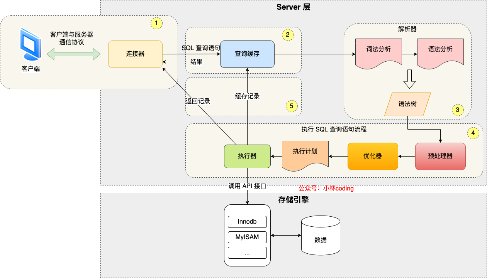
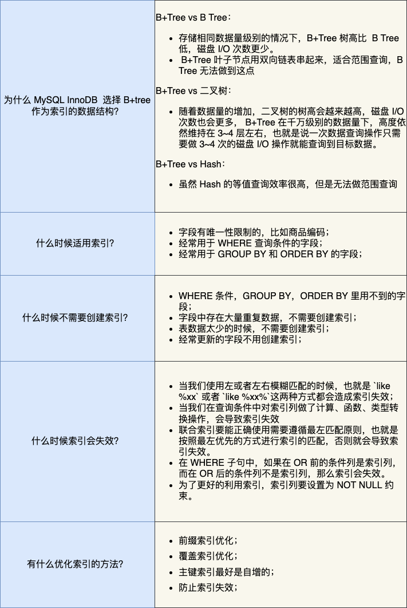
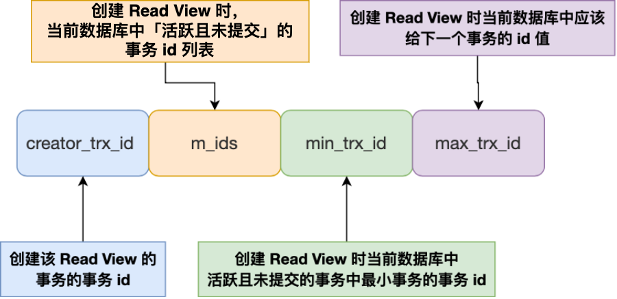
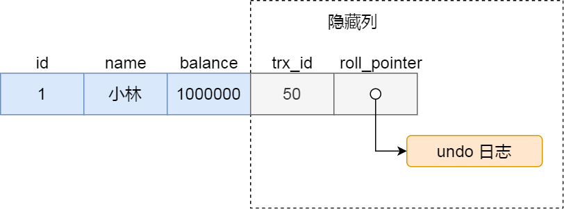
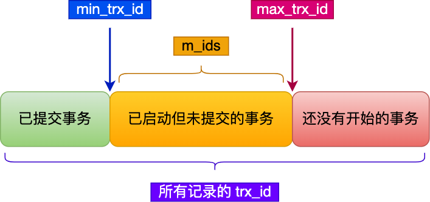

# mysql 相关

## 基础篇

### 执行一条 select 语句，期间发生了什么？



MySQL 的架构分为两层：Server 层和存储引擎层。

* Server 层负责建立连接、分析和执行 SQL。MySQL 大多数核心功能模块都在这层实现，包括连接器、查询缓存、解析器、预处理器、优化器、执行器等。另外所有内置函数（如时间、日期）和跨存储引擎的功能（如存储过程、触发器、视图等）都在 Server 层实现。
* 存储引擎层负责数据的存储和提取。支持 InnoDB 等若干 个存储引擎，不同的存储引擎共用一个 Server 层。默认存储引擎为 InnoDB，支持索引类型为 B+树，在数据表中创建的主键索引和二级索引默认使用的是 B+树索引。

#### 第一步：连接器

MySQL 的基于 TCP 协议进行传输，因此会通过 TCP 的三次握手进行建立连接。空闲连接会因为超时被关闭（默认为 8 小时）。max_connections 参数决定最大连接数。

长连接与短连接（概念与 HTTP 类似）：

短连接是执行完一条 SQL 语句后断开，长连接为执行完 SQL 语句后保持连接供下次使用。

长连接可以减少建立连接和断开连接的过程，但会随着连接时长的增加占用内存会增多，因为 MySQL 在执行查询过程中临时使用内存管理连接对象，这些连接对象只有在连接断开时才会释放。

**怎么解决长连接占用内存的问题？**

1. 定期断开长连接。既然断开连接后就会释放连接占用的内存资源，那么可以定期断开长连接后再新建连接。
2. 客户端主动重置连接。MySQL 5.7 版本实现了 `mysql_reset_connection()`函数的接口，注意这是接口不是命令，当客户端执行了一个很大的操作后，在代码里调用`mysql_reset_connection`函数来重置连接，达到释放内存的效果。这个过程不需要重连和重新做权限验证，但是会将连接恢复到刚刚创建完的状态。

#### 第二步：查询缓存

连接器连接完成后，客户端就会向 MySQL 服务器发送 SQL 语句了，MySQL 服务器会根据语句的第一个字段来决定这是个什么类型的语句。

若是查询语句（select 语句），MySQL 服务器会先去查询缓存（Query Cache）里查找缓存数据。查询缓存的数据结构为 key-value形式，key 为 SQL 查询语句，value 为 SQL 语句的查询结果。

对于更新频繁的表，查询缓存的命中率很低。因为只要一个字段有更新操作，那么这个表的查询缓存就会被清空。因此 MySQL 8.0 版本直接将查询缓存删掉了。

#### 第三步：解析 SQL

解析器会对 SQL 语句做词法分析与语法分析。如果语句有语法问题，会在这个阶段被拦住。

#### 第四步：执行 SQL

执行分为三个阶段：1.预处理阶段（prepare）；2.优化阶段（optimize）；3.执行阶段（execute）；

1.预处理阶段

* 检查 SQL 语句中的涉及的表和字段是否存在；
* 将 `*`扩展为表的所有列；

2.优化器

* 将 SQL 查询语句的执行方案确定下来，如决定选择哪个索引。

3.执行器

执行器会与存储引擎交互。

* 主键索引查询
* 全表扫描
* 索引下推
  * 索引下推能够减少二级索引在查询时的回表操作，提高查询效率。

>### 索引下推（Index Condition Pushdown）
>
>索引下推是数据库优化器的一个优化策略，用于提高查询性能。在普通索引扫描中，数据库系统会首先通过索引找到符合条件的记录，然后再通过回表操作获取相应的行数据，最后应用其他的过滤条件。而在索引下推优化中，一部分能在索引层就解决的过滤条件会被“推”到存储引擎层，这样可以减少不必要的数据读取和回表操作。
>
>例如，假设有一个带有 `(id, age)` 索引的 `users` 表，你想查询 `id > 100` 且 `age > 18` 的记录。在索引下推优化中，`age > 18` 这个条件可以直接在索引扫描过程中应用，而不需要先获取所有 `id > 100` 的记录然后再过滤 `age > 18`。

>### 回表操作（Lookup）
>
>回表操作是在利用非聚簇索引（或称为二级索引、辅助索引）进行查询时可能会出现的一个步骤。当索引不包含查询所需的所有信息时，数据库系统需要通过索引中的指针回到主表（聚簇索引表）中查找完整的行数据。
>
>例如，假设有一个 `students` 表，主键是 `student_id`，并有一个非聚簇索引是 `(first_name, last_name)`。如果你要查询所有名为 "John" 的学生的所有信息，那么数据库首先会使用 `(first_name, last_name)` 索引找到所有符合条件的记录，然后它需要“回表”到主表中，通过 `student_id` 获取这些学生的其他信息。
>
>在进行回表操作时，IO成本和CPU使用率通常会增加，因此在数据库设计和查询优化时，通常会尽量减少回表操作。

## 索引篇

索引的分类

按数据结构分类：B+树索引、Hash 索引、Full-text 索引。

按物理存储分类：聚簇索引（主键索引）、二级索引（辅助索引）。

按字段特性分类：主键索引、唯一索引、普通索引、前缀索引。

按字段个数分类：单列索引、联合索引。

在数据库系统（特别是关系数据库管理系统，如 MySQL）中，"聚簇索引"（Clustered Index）是一种特殊类型的索引，它会改变数据表中行的物理存储顺序。在聚簇索引中，索引的逻辑顺序和行的物理存储顺序相同，这就意味着表数据实际上是按照索引的顺序来存储的。

当一个表被定义时，如果有指定主键（Primary Key），则该主键默认会被用作聚簇索引的索引键。也就是说，数据表中的记录会根据主键值的顺序来进行存储。这种设置通常有助于加速基于主键的数据检索和排序操作。

以 MySQL 的 InnoDB 存储引擎为例，如果你没有显式地指定一个主键，InnoDB 引擎会尝试找一个唯一非空索引作为聚簇索引，如果也没有这样的索引，它会生成一个隐藏的聚簇索引。

创建表时，InnoDB 存储引擎会根据不同的场景选择不同的列作为索引：

* 如果有主键，则默认会使用主键作为聚簇索引的索引键；
* 如果没有主键，则选择第一个不包含 NULL 值的唯一列作为聚簇索引的索引键；
* 在上面两个都没有的情况下，InnoDB 将自动生成一个隐式自增 id 作为聚簇索引的索引键；

除了聚簇索引，其他索引都属于辅助索引，也被称为二级索引或非聚簇索引。**创建的主键索引和二级索引默认使用的是 B+Tree 索引**。

### 如何理解 B+树索引？

B+Tree 是一种多叉树，叶子节点才存放数据，非叶子节点只存放索引，而且每个节点里的数据是**按主键顺序存放**的。每一层父节点的索引值都会出现在下层子节点的索引值中，因此在叶子节点中，包括了所有的索引值信息，并且每一个叶子节点都有两个指针，分别指向下一个叶子节点和上一个叶子节点，形成一个双向链表。

数据库的索引和数据都是存储在硬盘的，我们可以把读取一个节点当作一次磁盘 I/O 操作。

B+Tree 存储千万级的数据只需要 3-4 层高度就可以满足，这意味着从千万级的表查询目标数据最多需要 3-4 次磁盘 I/O，所以**B+Tree 相比于 B 树和二叉树来说，最大的优势在于查询效率很高，因为即使在数据量很大的情况，查询一个数据的磁盘 I/O 依然维持在 3-4次。**

主键索引的 B+Tree 和二级索引的 B+Tree 区别如下：

- 主键索引的 B+Tree 的叶子节点存放的是实际数据，所有完整的用户记录都存放在主键索引的 B+Tree 的叶子节点里；
- 二级索引的 B+Tree 的叶子节点存放的是主键值，而不是实际数据。

### B+树相比与 B 树的优点？

B+树是B树的一种变体，它们之间有一些关键的差异。以下是B+树相对于B树的主要优点：

1. 更高的磁盘 I/O 效率：
   1. 在 B+树中，所有的值都存在于叶子节点，而中间节点只包含关键字信息。因此，对于范围查找操作，B+树只需要一次磁盘 I/O就能取回多个连接的键。相比之下，B 树可能需要多次 I/O 操作。
2. 稳定的查询性能：
   1. 由于所有数据都在叶子节点，B+树的每次查找都需要遍历从根到叶的路径，这使得查询操作的性能变得更加稳定。
3. 更有效的利用磁盘块：
   1. 由于 B+树的中间节点只存储关键字（不存储数据），它们通常可以存储更多的关键字，这意味着更低的树高和更少的磁盘 I/O 操作。
4. 叶子节点的链表结构：
   1. B+树的叶子节点通常通过链表相互连接。这使得范围查询和顺序访问变得非常高效。
5. 插入和删除操作带来的影响更小：
   1. 与 B 树相比，当数据被插入或删除时，B+树的结构更改通常更少，更集中。

### 什么是回表？

使用二级索引时，MySQL会先检索二级索引中的 B+树 的索引值，找到对应的叶子节点，然后获取主键值，然后再通过主键索引中的 B+树查询到对应的叶子节点，然后获取整行数据。这个过程叫回表，“回”的是主键索引的表。

### 什么是覆盖索引？

当查询的数据能在二级索引的 B+树的叶子节点里查询到时，例如主键值。此时就不同再查询主键索引。**这种在二级索引的 B+Tree 就能查询到结果的过程就叫作「覆盖索引」，也就是只需要查一个 B+Tree 就能找到数据**。

### 为什么 MySQL InnoDB 选择 B+树作为索引的数据结构？

***1、B+Tree vs B Tree***

B+Tree 只在叶子节点存储数据，而 B 树 的非叶子节点也要存储数据，所以 B+Tree 的单个节点的数据量更小，在相同的磁盘 I/O 次数下，就能查询更多的节点。

另外，B+Tree 叶子节点采用的是双链表连接，适合 MySQL 中常见的基于范围的顺序查找，而 B 树无法做到这一点。

***2、B+Tree vs 二叉树***

对于有 N 个叶子节点的 B+Tree，其搜索复杂度为`O(logdN)`，其中 d 表示节点允许的最大子节点个数为 d 个。

在实际的应用当中， d 值是大于100的，这样就保证了，即使数据达到千万级别时，B+Tree 的高度依然维持在 3~4 层左右，也就是说一次数据查询操作只需要做 3~4 次的磁盘 I/O 操作就能查询到目标数据。

而二叉树的每个父节点的儿子节点个数只能是 2 个，意味着其搜索复杂度为 `O(logN)`，这已经比 B+Tree 高出不少，因此二叉树检索到目标数据所经历的磁盘 I/O 次数要更多。

***3、B+Tree vs Hash***

Hash 在做等值查询的时候效率贼快，搜索复杂度为 O(1)。

但是 Hash 表不适合做范围查询，它更适合做等值的查询，这也是 B+Tree 索引要比 Hash 表索引有着更广泛的适用场景的原因。

### mysql 查询已经走了索引却还是出现了慢查询的原因？

即使 MySQL 查询使用了索引，也可能会出现慢查询的情况。

1. 不合适的索引：使用了索引不意味着使用了最优的索引。索引的选择、列的顺序和查询中的条件都可能影响索引的效率。
   1. 使用 `EXPLAIN` 来分析查询，并确保选择了最佳的索引。
   2. 根据查询的 WHERE 子句和 JOIN 条件，考虑添加或修改索引。
2. 索引覆盖率低：如果索引只覆盖查询的一部分列，那么对于未覆盖的列，MySQL 需要“回表查询”，这会导致性能降低。
   1. 考虑使用覆盖索引，即索引包含查询中的所有列，避免“**回表**”操作。
3. 深度分页：使用`LIMIT` 进行深度分页，如`LIMIT 10000, 10`,可能需要扫描大量的记录才能返回最后的 10 条记录。
   1. 考虑使用键值查询来获取下一页数据，而不是使用 OFFSET。
   2. 使用更复杂的查询策略，如搜索游标。
4. 查询中的函数和操作：在索引列上使用函数（例如`DATE()`、`UPPER()`等）或某些操作符（例如`LIKE '%value'`）可能导致索引无法使用或效率低下。
   1. 尽量避免在索引列上使用函数。
   2. 如果需要使用 `LIKE`，尽量避免前导通配符，例如使用 `value%` 而不是 `%value%`。
5. 数据量大：即使使用索引，如果查询范围涉及的数据量很大，那么处理和传输数据仍然可能需要很长时间。
   1. 考虑对数据进行分区。
   2. 定期归档或删除旧数据。
6. 数据和索引碎片化：表中的数据或索引可能已经碎片化，导致读操作效率下降。
   1. 定期优化表来减少碎片，使用 `OPTIMIZE TABLE`。
7. 缓存效率：如果查询结果或索引不在内存中的缓存（例如 InnoDB buffer pool）中，那么需要从磁盘读取，这会降低查询速度。
   1. 考虑增加缓存大小，例如调整 `innodb_buffer_pool_size`。
   2. 使用 `EXPLAIN` 确保查询利用了缓存。
8. 不合适的统计数据：MySQL 使用统计数据来决定使用哪个索引。如果这些统计数据过时或不准确，优化器可能会做出不佳的决策。
   1. 使用 `ANALYZE TABLE` 更新统计数据。
9. 全表扫描：有时，优化器可能认为全表扫描比使用索引更快，尤其是当涉及大量数据时。
   1. 重新考虑查询设计，确保 WHERE 子句具有选择性。
   2. 考虑添加或修改索引以避免全表扫描。
10. **查询设计问题**: 有时，查询的设计可能不是最优的，例如连接了不必要的表或选择了过多的列。
    1. 优化查询，避免不必要的 JOIN 操作。
    2. 只选择所需的列，而不是使用 `SELECT *`。

要准确地确定慢查询的原因，最好使用 `EXPLAIN` 命令来查看查询的执行计划，并分析其输出，以获得可能的性能瓶颈提示。

### 索引的缺点 

虽然索引在数据库查询优化中扮演了关键角色，但它们并不是无代价的。以下是索引的主要缺点：

1. 存储开销：
   1. 每个额外的索引都需要存储空间。对于大型数据库，多余的或不必要的索引可能会占用大量的磁盘空间。
2. 插入、更新和删除的性能开销（自动维护）：
   1. 当插入、更新或删除表中的行时，相关的索引也需要被更新。如果一个表有多个索引，这些操作的开销可能会显著增加，例如写操作延迟。
3. 索引维护（手动维护）：
   1. 随着数据的增长和变化，索引可能会变得碎片化，导致性能下降。这需要定期的维护操作，如重建索引。
4. 额外的复杂性：
   1. 选择、维护和管理正确的索引集可能会变得复杂。过多或不恰当的索引可能导致查询优化器选择次优的查询计划。
5. 锁定的开销：
   1. 在某些数据库系统中，当对数据进行修改时，相关的索引可能需要被锁定，这可能会导致并发性能问题。

尽管索引具有这些缺点，但在大多数情况下，它们为查询提供的性能优势远远超过了这些开销。关键是理解何时以及如何创建和使用索引，以及如何维护它们以保持最佳性能。适时地审查和清理不再需要的或冗余的索引也很重要。

### 有什么优化索引的方法？

* 前缀索引优化；
* 覆盖索引优化；
  * 使用联合索引，使得索引覆盖了要查询的字段，不用回表。
* 主键索引最好是自增的；
* 防止索引失效；
  * 索引失效的情况：
    * 当我们使用左或者左右模糊匹配的时候，也就是 `like %xx` 或者 `like %xx%`这两种方式都会造成索引失效；
    * 当我们在查询条件中对索引列做了计算、函数、类型转换操作，这些情况下都会造成索引失效；
    * 联合索引要能正确使用需要遵循最左匹配原则，也就是按照最左优先的方式进行索引的匹配，否则就会导致索引失效。
    * 在 WHERE 子句中，如果在 OR 前的条件列是索引列，而在 OR 后的条件列不是索引列，那么索引会失效。

常见扫描类型的**执行效率从低到高的顺序为**：

- All（全表扫描）；
- index（全索引扫描）；
- range（索引范围扫描）；
- ref（非唯一索引扫描）；
- eq_ref（唯一索引扫描）；
- const（结果只有一条的主键或唯一索引扫描）。



## 事务篇

事务的 4 个特性：1.原子性（**Atomicity**）；2.一致性（**Consistency**）；3.隔离性（**Isolation**）；4.持久性（**Durability**）；

InnoDB 引擎通过什么技术来保证事务的这四个特性的呢？

- 持久性是通过 redo log （重做日志）来保证的；
- 原子性是通过 undo log（回滚日志） 来保证的；
- 隔离性是通过 MVCC（多版本并发控制） 或锁机制来保证的；
- 一致性则是通过持久性+原子性+隔离性来保证；

### 并行事务会引起什么问题？

MySQL 服务端是允许多个客户端连接的，这意味着 MySQL 会出现同时处理多个事务的情况。

那么**在同时处理多个事务的时候，就可能出现脏读（dirty read）、不可重复读（non-repeatable read）、幻读（phantom read）的问题**。

脏读：读到其他事务未提交的数据；

不可重复读：在一个事务内，前后读取的数据不一致；

幻读：前后读取的记录数量不一致；

MySQL 的四种隔离级别：1.读未提交；2.读提交；3.可重复读；4.串行化；

**MySQL InnoDB 引擎的默认隔离级别虽然是「可重复读」，但是它很大程度上避免幻读现象**，解决方案有以下两种：

- 针对**快照读**（普通 select 语句），是**通过 MVCC 方式解决了幻读**，因为可重复读隔离级别下，事务执行过程中看到的数据，一直跟这个事务启动时看到的数据是一致的，即使中途有其他事务插入了一条数据，是查询不出来这条数据的，所以就很好了避免幻读问题。
- 针对**当前读**（select ... for update 等语句），是**通过 next-key lock（记录锁+间隙锁）方式解决了幻读**，因为当执行 select ... for update 语句的时候，会加上 next-key lock，如果有其他事务在 next-key lock 锁范围内插入了一条记录，那么这个插入语句就会被阻塞，无法成功插入，所以就很好了避免幻读问题。

### 四种隔离级别

1.读未提交；2.串行化；3.读提交；4.可重复读；

### 这四种隔离级别是如何实现的呢？

读未提交：直接读取最新的数据。

串行化：通过加读写锁的方式来避免并行访问；

读提交与可重复读：它们是通过 Read View 来实现的，区别在于它们创建 Read View 的时机不同。读提交隔离级别是在每个语句执行前都会重新生成一个 Read View，而可重复读隔离级别是启动事务时生成一个 Read View，然后整个事务期间都在用这个 Read View。

在 MySQL 有两种开启事务的命令，分别是：

1. begin/start transaction 命令；
   1. 执行了 begin/start transaction 命令后，并不代表事务启动了。只有执行了该命令后，执行了增删改查动作的 SQL 语句，才是事务真正启动的时机；
2. Start transaction with consistent snapshot 命令；
   1. 执行 Start transaction with consistent snapshot 命令后，会马上启动事务；

### Read View 在 MVCC 中是如何工作的？

Read View 中的四个字段



* m_ids:指的是在创建 Read View 时，当前数据库中“活跃事务”的事务 id 列表。“活跃事务”指的是，启动了但还没有提交的事务。
* min_trx_id:指的是在创建 Read View 时，当前数据库中「活跃事务」中事务 **id 最小的事务**，即 m_ids 的最小值。
* max_trx_id ：这个并不是 m_ids 的最大值，而是**创建 Read View 时当前数据库中应该给下一个事务的 id 值**，也就是全局事务中最大的事务 id 值 + 1；
* creator_trx_id ：指的是**创建该 Read View 的事务的事务 id**。

聚簇索引记录中两个隐藏列



对于使用 InnoDB 存储引擎的数据库表，它的聚簇索引记录中都包含下面两个隐藏列：

- trx_id，当一个事务对某条聚簇索引记录进行改动时，就会**把该事务的事务 id 记录在 trx_id 隐藏列里**；
- roll_pointer，每次对某条聚簇索引记录进行改动时，都会把旧版本的记录写入到 undo 日志中，然后**这个隐藏列是个指针，指向每一个旧版本记录**，于是就可以通过它找到修改前的记录。

在创建 Read View 后，可以将记录中的 trx_id 划分这三种情况：



一个事务去访问记录的时候，除了自己的更新记录总是可见之外，还有这几种情况：

- 如果记录的 trx_id 值小于 Read View 中的 `min_trx_id` 值，表示这个版本的记录是在创建 Read View **前**已经提交的事务生成的，所以该版本的记录对当前事务**可见**。
- 如果记录的 trx_id 值大于等于 Read View 中的 `max_trx_id` 值，表示这个版本的记录是在创建 Read View **后**才启动的事务生成的，所以该版本的记录对当前事务**不可见**。
- 如果记录的 trx_id 值在 Read View 的`min_trx_id`和`max_trx_id`之间，需要判断 trx_id 是否在 m_ids 列表中：
  - 如果记录的 trx_id **在** `m_ids` 列表中，表示生成该版本记录的活跃事务依然活跃着（还没提交事务），所以该版本的记录对当前事务**不可见**。
  - 如果记录的 trx_id **不在** `m_ids`列表中，表示生成该版本记录的活跃事务已经被提交，所以该版本的记录对当前事务**可见**。

**这种通过「版本链」来控制并发事务访问同一个记录时的行为就叫 MVCC（多版本并发控制）。**

InnoDB 引擎的默认隔离级别虽然是「可重复读」，但是它很大程度上避免幻读现象，解决的方案有两种：

- 针对**快照读**（普通 select 语句），是**通过 MVCC 方式解决了幻读**，因为可重复读隔离级别下，事务执行过程中看到的数据，一直跟这个事务启动时看到的数据是一致的，即使中途有其他事务插入了一条数据，是查询不出来这条数据的，所以就很好了避免幻读问题。
- 针对**当前读**（select ... for update 等语句），是**通过 next-key lock（记录锁+间隙锁）方式解决了幻读**，因为当执行 select ... for update 语句的时候，会加上 next-key lock，如果有其他事务在 next-key lock 锁范围内插入了一条记录，那么这个插入语句就会被阻塞，无法成功插入，所以就很好了避免幻读问题。

对于「读提交」和「可重复读」隔离级别的事务来说，它们是通过 Read View 来实现的，它们的区别在于创建 Read View 的时机不同：

- 「读提交」隔离级别是在每个 select 都会生成一个新的 Read View，也意味着，事务期间的多次读取同一条数据，前后两次读的数据可能会出现不一致，因为可能这期间另外一个事务修改了该记录，并提交了事务。
- 「可重复读」隔离级别是启动事务时生成一个 Read View，然后整个事务期间都在用这个 Read View，这样就保证了在事务期间读到的数据都是事务启动前的记录。

这两个隔离级别实现是通过「事务的 Read View 里的字段」和「记录中的两个隐藏列」的比对，来控制并发事务访问同一个记录时的行为，这就叫 MVCC（多版本并发控制）。

在可重复读隔离级别中，普通的 select 语句就是基于 MVCC 实现的快照读，也就是不会加锁的。而 select .. for update 语句就不是快照读了，而是当前读了，也就是每次读都是拿到最新版本的数据，但是它会对读到的记录加上 next-key lock 锁。

## 锁篇

根据加锁的范围可分为**全局锁、表级锁和行锁**三类。

## 日志篇

主从复制是怎么实现的。


## SQL 语句

### 给你一张表，列为 id, name, class, score, 找出每个班最高分的记录

使用 `GROUP BY` 来找出每个班级的最高分记录可以通过子查询或者 JOIN 操作来实现。以下是一个基于子查询的示例：

```sql
SELECT s.id, s.name, s.class, s.score
FROM students s
JOIN (
    SELECT class, MAX(score) as max_score
    FROM students
    GROUP BY class
) as max_scores
ON s.class = max_scores.class AND s.score = max_scores.max_score;
```

在这个查询中：
- 子查询首先为每个班级找到最大的分数。
- 主查询然后通过 `JOIN` 将原始的 `students` 表与这些最大的分数进行匹配，从而找到每个班级获得最大分数的学生。

需要注意的是，如果一个班级有两个或更多的学生获得相同的最高分，这个方法会返回这个班级的所有这些学生的记录。

### 为我解释左连接和右连接和全连接

当我们谈论关系型数据库中的 JOIN 操作时，连接（JOIN）是用于组合两个表中的行的方法。基于这两个表之间的某些列的值进行组合。左连接（LEFT JOIN）、右连接（RIGHT JOIN）和全连接（FULL JOIN）是 JOIN 操作的三种类型。下面是它们的解释：

1. **左连接 (LEFT JOIN)**:
   - 返回左表中的所有记录和右表中与之匹配的记录。
   - 如果左表中的某条记录在右表中没有匹配的记录，则该条记录的右表列将为 NULL。

   示例:
   ```
   Table A                Table B
   id  name               id  desc
   1   Apple              1   Fruit
   2   Ball               3   Toy
   
   LEFT JOIN on id:
   id  name  desc
   1   Apple Fruit
   2   Ball  NULL
   ```

2. **右连接 (RIGHT JOIN)**:
   - 返回右表中的所有记录和左表中与之匹配的记录。
   - 如果右表中的某条记录在左表中没有匹配的记录，则该条记录的左表列将为 NULL。

   示例:
   ```
   Table A                Table B
   id  name               id  desc
   1   Apple              1   Fruit
   2   Ball               3   Toy
   
   RIGHT JOIN on id:
   id  name   desc
   1   Apple  Fruit
   3   NULL   Toy
   ```

3. **全连接 (FULL JOIN)**:
   - 返回左表和右表中的所有记录。
   - 如果左表中的某条记录在右表中没有匹配的记录，那么右表的列将为 NULL，反之亦然。

   示例:
   ```
   Table A                Table B
   id  name               id  desc
   1   Apple              1   Fruit
   2   Ball               3   Toy
   
   FULL JOIN on id:
   id  name   desc
   1   Apple  Fruit
   2   Ball   NULL
   3   NULL   Toy
   ```

需要注意的是，并不是所有的数据库系统都支持所有这三种类型的 JOIN。例如，MySQL 支持左连接和右连接，但不支持全连接。然而，你可以通过组合 LEFT JOIN 和 UNION 操作来模拟 FULL JOIN。

在 `LEFT JOIN` 查询中，左表（或主表）是 `JOIN` 关键字左侧的表。具体来说，当你执行如下查询时：

```sql
SELECT s.id, s.name, sc.subject, sc.score
FROM students s
LEFT JOIN scores sc ON s.id = sc.student_id;
```

在这个查询中，`students` 表（别名为 `s`）是左表，而 `scores` 表（别名为 `sc`）是右表。

左连接（`LEFT JOIN`）的意思是返回左表中的所有记录，以及与之匹配的右表中的记录。如果左表中的某条记录在右表中没有匹配的记录，则该条记录的右表列将为 NULL。

在 `RIGHT JOIN` 查询中，右表是 `JOIN` 关键字右侧的表。具体来说，当你执行以下查询时：

```sql
SELECT s.id, s.name, sc.subject, sc.score
FROM students s
RIGHT JOIN scores sc ON s.id = sc.student_id;
```

在这个查询中，`students` 表（别名为 `s`）是左表，而 `scores` 表（别名为 `sc`）是右表。

右连接（`RIGHT JOIN`）的意思是返回右表中的所有记录，以及与之匹配的左表中的记录。如果右表中的某条记录在左表中没有匹配的记录，则该条记录的左表列将为 NULL。
